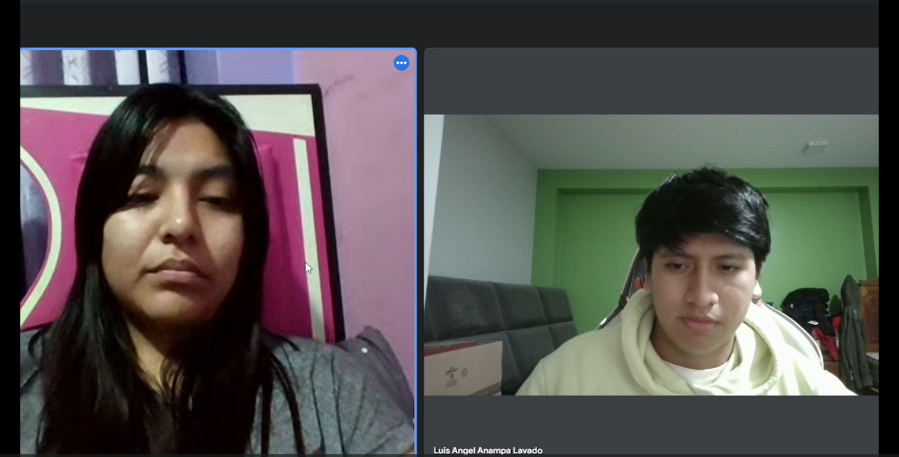
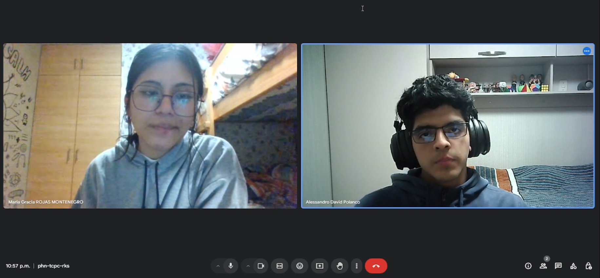
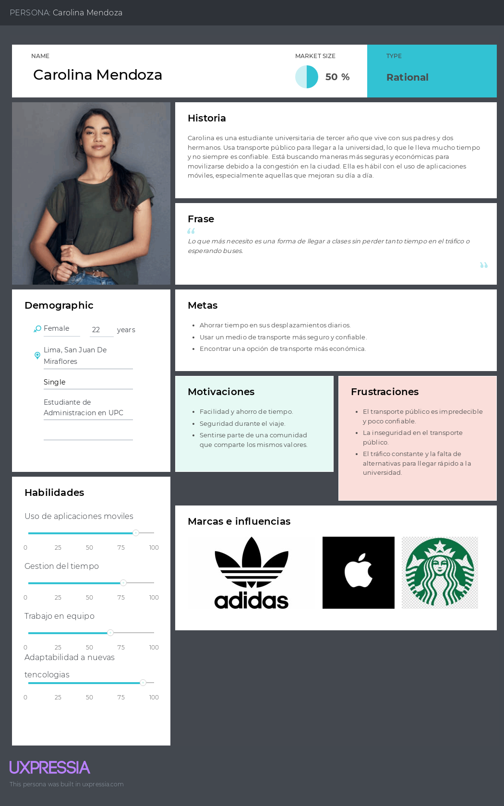
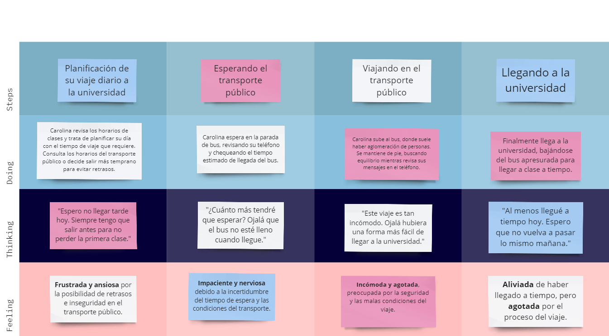
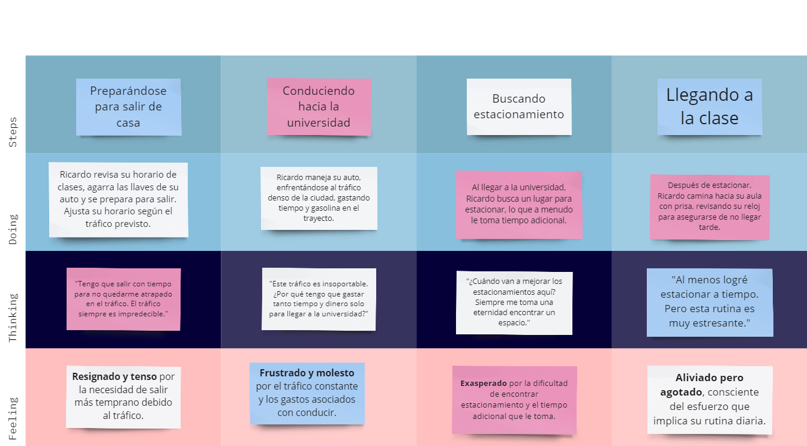

# Capítulo II: Requirements Elicitation & Analysis
## 2.1. Competidores
### BlaBlaCar
Es una plataforma global de ride-sharing que conecta conductores y pasajeros para 
compartir viajes de media y larga distancia. Los usuarios pueden dividir los costos del viaje, 
lo que hace que el transporte sea más económico y sostenible. BlaBlaCar fomenta la colaboración y 
la optimización de recursos al reducir la cantidad de vehículos en la carretera.

### Urbvan
Es una plataforma de transporte privado en van que opera en rutas predefinidas, generalmente en áreas
metropolitanas. Se enfoca en ofrecer una alternativa más eficiente y cómoda al transporte público, 
brindando un servicio seguro y puntual a través de vehículos compartidos, pero con un enfoque de 
calidad y confort para los usuarios.

### Yango
Es una aplicación internacional de ride-hailing que ofrece transporte bajo demanda con tarifas 
competitivas y un enfoque en la facilidad de uso. Opera en diversas ciudades del mundo, brindando a 
los usuarios una experiencia de transporte rápida, segura y accesible, con la opción de reservar y 
pagar viajes directamente a través de la aplicación.

### 2.1.1. Análisis competitivo
<table>
  <tr>
    <th colspan="7" valign="top"><b>Competitive Analysis Landscape</b></th>
  </tr>
  <tr>
    <td colspan="2" rowspan="2">¿Por qué llevar a cabo este análisis?</td>
    <td colspan="5">Escriba en el recuadro la pregunta que busca responder o el objetivo de este análisis.</td>
  </tr>
  <tr>
    <td colspan="5">Este análisis se esta llevando a cabo para connotar las diferencias con las empresas competidoras y tomar sus amenazas
    como nuevas oportunidades en nuestro producto para poder innovar.</td>
  </tr>
  <tr>
    <td colspan="3">(En la cabecera colocar por cada competidor nombre y logo)</td>
    <td colspan="1" valign="top" style="font-weight: bold;">
        GoUni
         
        

                
        

    <td colspan="1" valign="top" style="font-weight: bold;">
    BlaBlaCar
    

                
        

    </td>
    <td colspan="1" valign="top" style="font-weight: bold;">
      Urbvan
      

                
            

      </td>
    <td colspan="1" valign="top" style="font-weight: bold;" >
      Yango
      

                
            

    </td>
  </tr>
  <tr>
    <td colspan="1" rowspan="2">
Perfil
</td>
    <td colspan="2">Overview</td>
    <td colspan="1" valign="top">Plataforma de ride-sharing entre estudiantes universitarios en Perú, centrada en la 
    colaboración, sostenibilidad y reducción de costos de transporte.</td>
    <td colspan="1" valign="top">Plataforma global de ride-sharing para viajes interurbanos, 
    donde conductores y pasajeros comparten viajes y gastos.</td>
    <td colspan="1" valign="top">Plataforma de transporte privado en van con rutas predefinidas, 
    enfocada en eficiencia y comodidad.</td>
    <td colspan="1" valign="top">Aplicación internacional de ride-hailing que se enfoca en 
    ofrecer tarifas competitivas y una experiencia sencilla de uso.</td>
  </tr>
  <tr>
    <td colspan="2">Ventaja competitiva</td>
    <td colspan="1" valign="top">Focalización en estudiantes universitarios, fomentando una comunidad cerrada y 
    segura con intereses comunes; enfoque en sostenibilidad.</td>
    <td colspan="1" valign="top">Operación a nivel global con una amplia base de usuarios; 
    experiencia consolidada en viajes largos.</td>
    <td colspan="1" valign="top">Ofrece transporte cómodo y seguro en rutas fijas; 
    ideal para desplazamientos largos dentro de la ciudad.</td>
    <td colspan="1" valign="top">Tarifas competitivas y experiencia de usuario sencilla, 
    rápida expansión en diversas ciudades.</td>
  </tr>
  <tr>
    <td colspan="1" rowspan="2">
Perfil de Marketing
</td>
    <td colspan="2">Mercado objetivo</td>
    <td colspan="1" valign="top">Estudiantes universitarios en Perú que buscan compartir viajes seguros, 
    económicos y sostenibles con sus compañeros.</td>
    <td colspan="1" valign="top">Viajeros interurbanos que buscan reducir costos y socializar en viajes largos.</td>
    <td colspan="1" valign="top">Profesionales y estudiantes que requieren transporte cómodo y 
    eficiente en rutas fijas dentro de la ciudad.</td>
    <td colspan="1" valign="top">Usuarios urbanos que buscan transporte asequible y 
    rápido en varias ciudades de América Latina.</td>
  </tr>
  <tr>
    <td colspan="2">Estrategias de marketing</td>
    <td colspan="1" valign="top">Enfoque en el marketing digital y redes sociales en entornos estudiantiles; 
    colaboraciones con universidades para promociones.</td>
    <td colspan="1" valign="top">Campañas de marketing enfocadas en la experiencia compartida, 
    la comunidad y la reducción de costos de viaje.	</td>
    <td colspan="1" valign="top">Enfoque en la eficiencia, seguridad y confort en el transporte urbano; 
    promociones y descuentos para usurios frecuentes.</td>
    <td colspan="1" valign="top">Enfoque en tarifas competitivas, promociones frecuentes y facilidad de uso; 
    expansión rápida y adquisición de nuevos usuarios.</td>
  </tr>
  <tr>
    <td colspan="1" rowspan="3">
Perfil de Producto
</td>
    <td colspan="2">Productos & Servicios</td>
    <td colspan="1" valign="top">Plataforma de ride-sharing exclusiva para estudiantes 
    universitarios, con opciones para compartir viajes cortos y largos dentro de la ciudad.</td>
    <td colspan="1" valign="top">Ride-sharing interurbano, conectando conductores 
    y pasajeros en viajes de larga distancia.</td>
    <td colspan="1" valign="top">Servicios de transporte en vans con rutas fijas; 
    asientos reservados y viajes cómodos.</td>
    <td colspan="1" valign="top">Ride-hailing en tiempo real con diferentes tipos de vehículos; 
precios competitivos y una plataforma fácil de usar.</td>
  </tr>
  <tr>
    <td colspan="2">Precios & Costos</td>
    <td colspan="1" valign="top">Precios asequibles con base en compartir costos de 
    viaje; enfoque en la economía colaborativa.</td>
    <td colspan="1" valign="top">Compartir costos de viaje entre conductores y pasajeros; 
    enfoque en la reducción de costos de viaje.</td>
    <td colspan="1" valign="top">Tarifas fijas según las rutas y horarios predefinidos; enfoque en la comodidad.</td>
    <td colspan="1" valign="top">Tarifas accesibles con promociones frecuentes; 
    modelo basado en precios competitivos y flexibles.</td>
  </tr>
  <tr>
    <td colspan="2">Canales de distribución (Web y/o Móvil)</td>
    <td colspan="1" valign="top">Aplicación móvil enfocada en estudiantes universitarios, 
    con soporte web para registros y gestión de viajes.</td>
    <td colspan="1" valign="top">Aplicación móvil y web con acceso a reservas 
    de viajes compartidos en toda la región.</td>
    <td colspan="1" valign="top">Aplicación móvil y reservas web para la gestión de rutas y viajes en vans.</td>
    <td colspan="1" valign="top">Aplicación móvil fácil de usar disponible en múltiples ciudades de América Latina.</td>
  </tr>
  <tr>
    <td colspan="1" rowspan="5">
Análisis SWOT
</td>
    <td colspan="6">Realice esto para su startup y sus competidores. Sus fortalezas deberían apoyar sus oportunidades y contribuir a lo que ustedes definen como su posible ventaja competitiva.</td>
  </tr>
  <tr>
    <td colspan="2">Fortalezas</td>
    <td colspan="1" valign="top">Enfoque en la comunidad estudiantil; servicio exclusivo y seguro; sostenibilidad.</td>
    <td colspan="1" valign="top">Amplia red global de usuarios; enfoque en viajes largos; reputación consolidada.</td>
    <td colspan="1" valign="top">Comodidad y eficiencia en rutas predefinidas; seguridad y confort en transporte urbano.</td>
    <td colspan="1" valign="top">Tarifas competitivas y fácil de usar; expansión rápida en diversas ciudades.</td>
  </tr>
  <tr>
    <td colspan="2">Debilidades</td>
    <td colspan="1" valign="top">Mercado limitado a estudiantes universitarios; competencia con transporte público económico.</td>
    <td colspan="1" valign="top">Dependencia de viajes largos; limitado a rutas interurbanas.</td>
    <td colspan="1" valign="top">Restricción de rutas fijas y horarios; costos más altos comparados con el transporte público tradicional.</td>
    <td colspan="1" valign="top">Competencia feroz en mercados urbanos; problemas con la regulación local.</td>
  </tr>
  <tr>
    <td colspan="2">Oportunidades</td>
    <td colspan="1" valign="top">Expansión a otras universidades y ciudades; colaboraciones con instituciones educativas.</td>
    <td colspan="1" valign="top">Expansión a mercados nuevos y emergentes; desarrollo de más servicios complementarios.</td>
    <td colspan="1" valign="top">Expansión a más rutas y ciudades; enfoque en ofrecer servicios corporativos.</td>
    <td colspan="1" valign="top">Crecimiento acelerado en más ciudades; enfoque en la mejora continua del servicio y tarifas.</td>
  </tr>
  <tr>
    <td colspan="2">Amenazas</td>
    <td colspan="1" valign="top">Competencia de aplicaciones de ride-hailing y transporte público; regulación gubernamental.</td>
    <td colspan="1" valign="top">Aparición de competidores más locales en áreas específicas; cambios en la regulación.</td>
    <td colspan="1" valign="top">Competencia con aplicaciones de ride-hailing y transporte público tradicional.</td>
    <td colspan="1" valign="top">Regulación gubernamental y competencia feroz en el mercado urbano de transporte.</td>
  </tr>
</table>

### 2.1.2. Estrategias y tácticas frente a competidores

- *Diferenciación de la plataforma:* GoUni se diferencia por ser una plataforma exclusiva para
  estudiantes universitarios. El enfoque en la comunidad académica y
  la seguridad brinda un entorno más cerrado y confiable en comparación con otras plataformas abiertas
  al público general. Además, su misión de promover la sostenibilidad y la economía colaborativa
  refuerza su atractivo para jóvenes conscientes del medio ambiente.
####
- *Comunidad activa:* Con GoUni queremos fomentar una comunidad de estudiantes comprometidos, creando
  un entorno en el que los usuarios se sienten seguros viajando con personas de su misma universidad.
  La cercanía entre los miembros de la comunidad facilita la interacción y genera confianza entre los
  usuarios.
####
- *Marketing dirigido:* El marketing en GoUni quiere enfocarse en captar a estudiantes universitarios mediante
  colaboraciones con universidades, eventos estudiantiles y promociones a través de redes sociales específicas
  para jóvenes. Esta comunicación apela a la sostenibilidad, la seguridad y la economía colaborativa, factores
  importantes para la comunidad estudiantil.
####
- *Monetización creativa:* La monetización de GoUni se basará en la compartición de costos entre estudiantes,
  pero puede explorar modelos adicionales como suscripciones premium que pudean ofrecer beneficios exclusivos,
  como rutas garantizadas o mayor seguridad. También podría implementar alianzas con marcas enfocadas en
  estudiantes, generando ingresos adicionales a través de publicidad contextual o colaboraciones.

## 2.2. Entrevistas
### 2.2.1. Diseño de entrevistas
En esta sección se han definido todas las preguntas que se plantearan en el momento de
realizar las preguntas a los diferentes segmntos objetivos

<h3> Preguntas Generales</h3>

1. ¿Cuál es tu nombre?
####
2. ¿Qué edad tienes?
####
3. ¿Dónde vives actualmente?
####
4. ¿A qué te dedicas?

<h3> Preguntas Segmento 1: Estudiantes universitarios </h3>

1. ¿Con qué frecuencia utilizas transporte para llegar a la universidad?
####
2. ¿Cuáles son las mayores dificultades que enfrentas al desplazarte a la universidad?
####
3. ¿Cuánto tiempo sueles tardar en llegar a la universidad desde tu casa?
####
4. ¿Estarías dispuesto a compartir tu trayecto con otros estudiantes? ¿Por qué?
####
5. ¿Qué factores te harían sentir más cómodo/a utilizando un servicio de ride-sharing para estudiantes?
####
6. ¿Cómo crees que un servicio de transporte compartido podría mejorar tu experiencia diaria?

<h3> Preguntas Segmento 2: Estudiantes universitarios propietarios de vehiculos privados</h3>

1. ¿Con qué frecuencia conduces hacia tu universidad o trabajo?
####
2. ¿Te gustaría compartir tu vehículo con otros estudiantes en tus trayectos?
####
4. ¿Cuáles son tus mayores preocupaciones al compartir tu vehículo con otras personas?
####
5. ¿Qué aspectos te motivarían a ofrecer tu vehículo en un servicio de ride-sharing?
####
6. ¿Qué tipo de incentivos te harían más propenso a unirte a una plataforma de ride-sharing para estudiantes?
####
7. ¿Cómo manejas los costos de mantenimiento y gasolina? ¿Crees que compartir tu vehículo podría ayudar a reducir esos costos?
####
8. ¿Cuáles son tus expectativas en cuanto a seguridad y comodidad al ofrecer tu vehículo para transportar a otros?

### 2.2.2 Registro de entrevistas.

*Segmento 1: Estudiantes Universitarios*

*Entrevista 1:*

Nombres: Melina

Apellidos: Rojas Sosa

Edad: 19

Lugar de residencia: Ate, Lima

Evidencia de la entrevista:

Enlace de entrevista: [Link de la entrevista](https://upcedupe-my.sharepoint.com/:v:/g/personal/u202218664_upc_edu_pe/EX7er1YUSwFDuVEixTyS9icBROnS8zoGjs_OYnidNOSFxg?e=aP2d71&nav=eyJyZWZlcnJhbEluZm8iOnsicmVmZXJyYWxBcHAiOiJTdHJlYW1XZWJBcHAiLCJyZWZlcnJhbFZpZXciOiJTaGFyZURpYWxvZy1MaW5rIiwicmVmZXJyYWxBcHBQbGF0Zm9ybSI6IldlYiIsInJlZmVycmFsTW9kZSI6InZpZXcifX0%3D)

Resumen de la entrevista:

Melina es una estudiante universitaria que enfrenta dificultades diarias para llegar a sus clases debido a la congestión vehicular en Lima. Ella expresa que estaría encantada si existiera un servicio de carpooling que le permitiera llegar más rápido a la universidad. Además, destaca los beneficios adicionales que este tipo de servicio podría ofrecer, como la oportunidad de hacer networking con otros estudiantes de su misma universidad.

*Entrevista 2:*

Nombres: Maria Gracia

Apellidos: Rojas Montenegro

Edad: 19

Lugar de residencia: Lima, Peru

Evidencia de la entrevista:

Enlace de la entrevista: https://upcedupe-my.sharepoint.com/:v:/g/personal/u202122232_upc_edu_pe/EdkBJ6BiIApNmPjECvCbqpYBZLdRyR5IUQ6hbW72k0wSNw?nav=eyJyZWZlcnJhbEluZm8iOnsicmVmZXJyYWxBcHAiOiJPbmVEcml2ZUZvckJ1c2luZXNzIiwicmVmZXJyYWxBcHBQbGF0Zm9ybSI6IldlYiIsInJlZmVycmFsTW9kZSI6InZpZXciLCJyZWZlcnJhbFZpZXciOiJNeUZpbGVzTGlua0NvcHkifX0&e=yEaifN

Resumen de la entrevista:

Maria Gracia es un estudiante universitaria de la UPC que no tiene muchas dificultades al momento de transportarse
desde su casa hacia la universidad. Ella comenta que le gustaria mucho una alternativa de transporte este servicio
de car-pooling dado a que podria conocer nuevas personas de la misma universidad, asi como ahorrar dinero para transporte
y es un metodo para movilizarte de manera mas rapida en casos de urgencia.

 

*Segmento 2: Estudiantes universitarios propietarios de vehiculos privados*

*Entrevista 1:*

Nombres: Maykol

Apellidos: Valencia

Edad: 22 años

Lugar de residencia: Selva Alegre, Arequipa

Evidencia de la entrevista:

Enlace de entrevista:

[Link de entrevista02_UniversitarioPropietarioDeAuto_MaykolValencia](https://upcedupe-my.sharepoint.com/:v:/g/personal/u202223781_upc_edu_pe/EdLl2jwqxtdDq2Nyq49ek8AB6cLqcac0HNUCa4ySmXv7LQ?nav=eyJyZWZlcnJhbEluZm8iOnsicmVmZXJyYWxBcHAiOiJTdHJlYW1XZWJBcHAiLCJyZWZlcnJhbFZpZXciOiJTaGFyZURpYWxvZy1MaW5rIiwicmVmZXJyYWxBcHBQbGF0Zm9ybSI6IldlYiIsInJlZmVycmFsTW9kZSI6InZpZXcifX0%3D&e=rswZ2B)

Resumen de la entrevista:

Maykol es un estudiante universitario propietario de un vehículo privado que se desplaza diariamente desde su casa hasta
la universidad. Él menciona que le gustaría compartir su vehículo con otros estudiantes para reducir los costos de transporte
y hacer nuevos amigos. Sin embargo, tiene preocupaciones sobre la seguridad y la comodidad de los pasajeros, por lo que
considera importante establecer reglas claras y un sistema de calificación para garantizar una experiencia positiva para todos.

*Entrevista 2:*

Nombre:

Apellido:

Edad:

Lugar de residencia:

Entrevistador:

Evidencia de la entrevista:

Enlace de entrevista:

Resumen de la entrevista:

 

### 2.2.3 Análisis de entrevistas.
<TABLE BORDER>
	<TR>
		<TD COLSPAN = 2 align=center>

*Características*</TD>

<TD align=center>

*Segmento1*
 
*Estudiantes universitarios*
</TD>

<TD align=center>

*Segmento2*
 
*Estudiantes universitarios propietarios de vehiculos privados*
</TD>

   </TR>
	<TR>
		<TD ROWSPAN = 4>

*Objetivas*
</TD>
<TD>.</TD>
<TD>.</TD>
<TD>.</TD>
</TR>
<TR>
<TD>.</TD>
<TD>.</TD>
<TD>.</TD>
</TR>
<TR>
<TD>.</TD>
<TD>.</TD>
<TD>.</TD>
</TR>
<TR>
<TD >.</TD>
<TD>.</TD>
<TD>.</TD>
</TR>

   <TR>
		<TD ROWSPAN = 4>

*Subjetivas*
</TD>
<TD>.</TD>
<TD>.</TD>
<TD>.</TD>
<TR>
<TD>.</TD>
<TD>.</TD>
<TD>.</TD>
</TR>
<TR>
<TD>.</TD>
<TD>.</TD>
<TD>.</TD>
</TR>
<TR>
<TD>.</TD>
<TD>.</TD>
<TD>.</TD>
</TR>
</TABLE>

## 2.3. Needfinding
### 2.3.1. User Personas

*Estudiantes universitarios:*

*Estudiantes Universitarios propietarios de vehiculos privados:*

### 2.3.2. User Task Matrix

A continuación se pueden apreciar los User Task Matrix de los segmentos objetivos.

<table align="center" border="1" width="90%" style="text-align:center;">
    <tr>
        <td></td>
        <td colspan=2>
            <b>User Persona</b>
        </td>
    </tr>
    <tr>
        <td></td>
        <td colspan=2>
            Segmento Objetivo:   <b>Estudiantes Universitarios</b> 
        </td>
    </tr>
    <tr>
        <td>
            <b>Task</b>
        </td>
        <td>
            <b>Frequency</b>
        </td>
        <td>
            <b>Importance</b>
        </td>
    </tr>
    <tr>
        <td>
            Buscar compañeros disponibles en la app
        </td>
        <td>
            High
        </td>
        <td>
            High
        </td>
    </tr>
    <tr>
        <td>
            Coordinar el punto de encuentro
        </td>
        <td>
            Medium
        </td>
        <td>
            Medium
        </td>
    </tr>
    <tr>
        <td>
            Realizar pagos a traves de la app
        </td>
        <td>
            Medium
        </td>
        <td>
            High
        </td>
    </tr>
    <tr>
        <td>
            Verificar la seguridad del conductor/compañeros	
        </td>
        <td>
            High
        </td>
        <td>
            High
        </td>
    </tr>
    <tr>
        <td>
            Calificar al conductor y el viaje
        </td>
        <td>
            Low
        </td>
        <td>
            Medium
        </td>
    </tr>
    <tr>
        <td>
            Planificar vaijes recurrentes
        </td>
        <td>
            Medium
        </td>
        <td>
            High
        </td>
    </tr>
    <tr>
        <td>
            Ser participe de promociones o descuentos
        </td>
        <td>
            Low
        </td>
        <td>
            Medium
        </td>
    </tr>
</table>

  

<table align="center" border="1" width="90%" style="text-align:center;">
    <tr>
        <td></td>
        <td colspan=2>
            <b>User Persona</b>
        </td>
    </tr>
    <tr>
        <td></td>
        <td colspan=2>
            Segmento Objetivo:   <b>Estudiantes universitarios propietarios de vehiculos privados</b>  
        </td>
    </tr>
    <tr>
        <td>
            <b>Task</b>
        </td>
        <td>
            <b>Frequency</b>
        </td>
        <td>
            <b>Importance</b>
        </td>
    </tr>
    <tr>
        <td>
            Publicar la disponibilidad del vehiculo
        </td>
        <td>
            High
        </td>
        <td>
            High
        </td>
    </tr>
    <tr>
        <td>
            Aceptar solicitudes de pasajero
        </td>
        <td>
            High
        </td>
        <td>
            High
        </td>
    </tr>
    <tr>
        <td>
            Coordinar horarios y puntos de recogida
        </td>
        <td>
            Medium
        </td>
        <td>
            Medium
        </td>
    </tr>
    <tr>
        <td>
            Recibir pago de los pasajeros	
        </td>
        <td>
            High
        </td>
        <td>
            High
        </td>
    </tr>
    <tr>
        <td>
            Revisar la seguridad y confiabilidad del pasajero
        </td>
        <td>
            Medium
        </td>
        <td>
            High
        </td>
    </tr>
    <tr>
        <td>
            Calificar a los pasajeros
        </td>
        <td>
            Low
        </td>
        <td>
            Medium
        </td>
    </tr>
    <tr>
        <td>
            Optimizar rutas para ahorrar tiempo y combustible
        </td>
        <td>
            Medium
        </td>
        <td>
            High
        </td>
    </tr>
</table>

  

### 2.3.3. User Journey Mapping

A continuación se pueden apreciar los User Journey Mapping de los segmentos objetivos.

*Estudiantes Universitarios*

*Estudiantes universitarios propietarios de vehiculos privados*

### 2.3.4. Empathy Mapping

A continuación se pueden apreciar los Empathy Mapping de los segmentos objetivos.

*Estudiantes Universitarios*

*Estudiantes universitarios propietarios de vehiculos privados*

### 2.3.5. As-is Scenario Mapping

A continuación se pueden apreciar los As-Is Scenario de los segmentos objetivos.

*Estudiantes Universitarios*

*Estudiantes universitarios propietarios de vehiculos privados*

*Enlace de Miro:* https://miro.com/app/board/uXjVKlGuWKk=/?share_link_id=612949293517

## 2.4. Ubiquitous Language

- **Usuario**: Estudiante universitario registrado en la plataforma, ya sea como conductor o pasajero.
####
- **Conductor**: Estudiante universitario que posee un vehículo y está dispuesto a compartir su viaje hacia la universidad con otros estudiantes a cambio de una compensación económica.
####
- **Pasajero**: Estudiante universitario que utiliza la plataforma para buscar conductores con rutas compatibles y compartir un viaje hacia su universidad a cambio de una tarifa.
####
- **Viaje Compartido**: Desplazamiento en un vehículo particular en el que participan un conductor y uno o más pasajeros que comparten una ruta similar hacia la universidad.
####
- **Ruta**: Trayectoria específica que sigue un conductor desde su punto de origen hasta la universidad, la cual es compartida con los pasajeros a través de la plataforma.
####
- **Carpooling**: El acto de compartir un viaje entre varias personas para optimizar el uso de un vehículo particular, reducir costos y disminuir la congestión vehicular.
####
- **Reserva de Viaje**: Proceso mediante el cual un pasajero asegura un asiento en el vehículo de un conductor para un viaje específico, siguiendo una ruta y horario predeterminado.
####
- **Tarifa**: Costo que un pasajero paga al conductor por compartir el viaje. Esta tarifa cubre una parte de los gastos del conductor, como el combustible.
####
- **Perfil del Usuario**: Información detallada que cada usuario (conductor o pasajero) proporciona a la plataforma, incluyendo su nombre, universidad, calificaciones previas, y preferencias de viaje.
####
- **Calificación**: Sistema de puntuación que los pasajeros y conductores otorgan mutuamente después de cada viaje, basado en aspectos como puntualidad, seguridad y comportamiento durante el trayecto.
####
- **Notificación**: Comunicación enviada a los usuarios a través de la plataforma, informándoles sobre el estado de su reserva, cambios en la ruta, o recordatorios de viaje.
####
- **Punto de Encuentro**: Lugar acordado donde el conductor y los pasajeros se reúnen para iniciar el viaje compartido.
####
- **Destino**: La universidad u otro lugar predeterminado donde el viaje compartido finaliza.
