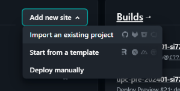
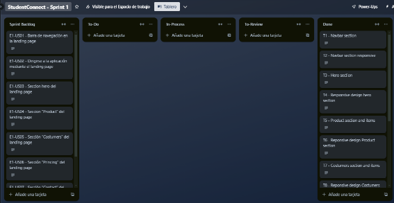
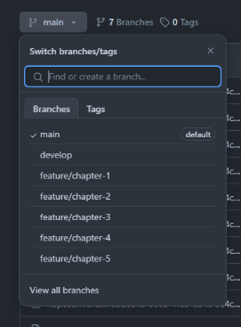
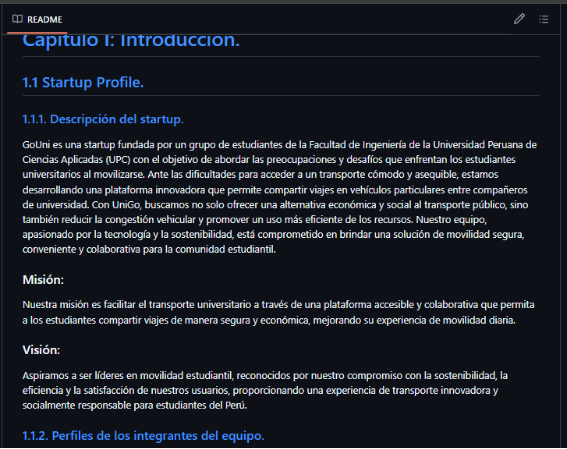
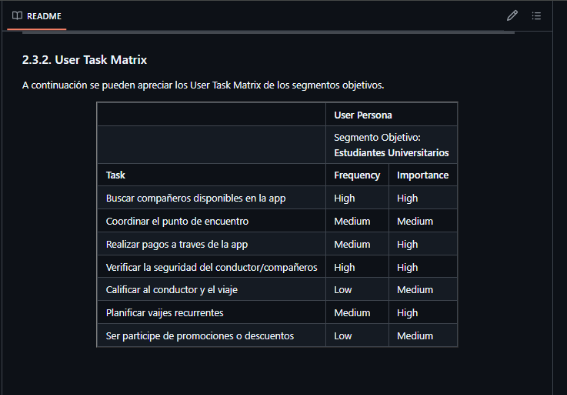
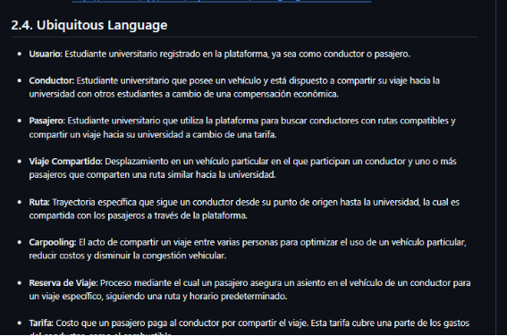
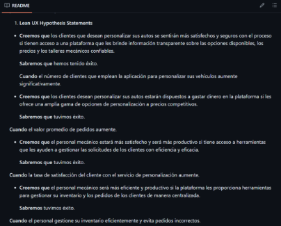
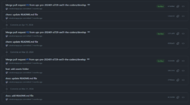

# Capítulo V: Product Implementation, Validation & Deployment

## 5.1. Software Configuration Management.
En la sección siguiente, se describirán las herramientas, convenciones, referencias y
onfiguraciones utilizadas durante el desarrollo del proyecto, las cuales ayudaron a
mantener la coherencia en el trabajo realizado.

### 5.1.1. Software Development Environment Configuration.
En esta parte, se mencionarán los distintos programas de software que el equipo de desarrollo utilizó para llevar a cabo las tareas relacionadas con la creación del proyecto.

 

**Project Management**

- Trello: <https://trello.com/>

La plataforma de Trello se empleó para la gestión de las tareas y la organización del flujo del trabajo en el proyecto. Presentándose las tareas dentro de las tarjetas en listas con el integrante encargado de realizarla. Además, utilizamos las funcionalidades como agregar las etiquetas de colores y marcar el proceso de las tareas. De esta manera pudimos hacer seguimiento a nuestros avances en el proyecto.

- Notion: <https://www.notion.so/>  

La plataforma de Notion fue utilizada para la colaboración de los integrantes con el proyecto. Se crearon calendarios y listas con las fechas de las reuniones del equipo. Además, se hizo uso de herramientas como comentarios y menciones para fomentar el trabajo y colaboración en equipo.

**Requirements Management**

- Trello: <https://trello.com/> 

Empleamos Trello para organizar los requisitos de la aplicación. En el que tenemos al product backlog el cual ordenamos según la prioridad aplicando Fibonacci para enumerar las historias de usuario y en otra sección organizándolas según las épicas.

**Product UX/UI Design**

- Figma: <https://www.figma.com/> 

La plataforma de Figma nos ayudó a desarrollar los wireframes, mockups y prototyping del mobile applications.

- Miro: <https://miro.com/es/> 

Miro nos fue de utilidad para poder realizar los As-Is Scenario Mapping y  To-Be Scenraio Mapping para cada uno de los segmentos objetivos.

- UXPressia: <https://uxpressia.com/> 

La plataforma UXPressia se empleó para la creación de los User Personas, Empathy Maps, Journey Maps e Impact Maps. Hemos hecho uso de las plantillas que UXPressia nos ofrece para elaborar cada una de ellas. Nos permitió exportar lo que se realizó para incluirlo en el trabajo.

**Software Development**

- Landing Page

Para el desarrollo de la landing page se hará empleó de HTML5, CSS y JavaScript.

- Frontend Web Application

Para desarrollar la aplicación web frontend, es esencial tener una comprensión sólida de los fundamentos de HTML, CSS y JavaScript. En nuestro caso, optamos por utilizar Angular como framework de JavaScript. Además, para facilitar la creación de componentes reutilizables y accesibles, decidimos emplear PrimeNG como biblioteca de componentes UI. Nuestro stack tecnológico incluye el uso del lenguaje Java con el framework Spring Boot, junto con HTML, Angular, JavaScript, CSS y una base de datos MySQL.

**Software Testing**

Para las pruebas funcionales del software, tanto como de la Landing page y de la aplicación web, hemos utilizado las herramientas de desarrollo de los navegadores web siguientes: Google Chrome (<https://www.google.com/chrome/>), Microsoft Edge (<https://www.microsoft.com/en-us/edge>) y Mozilla Firefox (<https://www.mozilla.org/en-US/firefox/browsers/>).

**Software Deployment**

- Netlify: <https://www.netlify.com/> 

Para implementar el despliegue de la Landing Page, se llevó a cabo la conexión entre el repositorio de Github y Netlify. Esto permite que Netlify maneje automáticamente la implementación de la Landing Page cada vez que se realice una actualización en el repositorio.

**Software Documentation**

- Google Drive: <https://www.google.com/intl/es-419_pe/drive/> 

Esta plataforma fue empleada para crear documentos mediante Google Docs, el cual nos permite trabajar de manera colaborativa los informes de las entregas.

- Structurizr: <https://structurizr.com/> 

Herramienta utilizada para la creación de diagramas C4 (diagrama de contexto, diagrama de contenedor y diagrama de componentes). Para elaborar los diagramas fue necesario utilizar una sintaxis parecida a un lenguaje de programación.

- GitHub: <https://github.com/> 

Plataforma empleada tanto como para la creación de la documentación y de la Landing page. Nuestro eligió esta plataforma debido a que nos permite trabajar de manera colaborativa. 

2. **Source Code Management**

La administración y estructuración de las múltiples modificaciones se realizaron mediante la creación de un repositorio en GitHub para el proyecto. Nuestra organización se estructuró de la siguiente manera:

Organización: <https://github.com/Open-Source-SW53-Group-2> 

   Repositorio de la Landing page: <https://github.com/Open-Source-SW53-Group-2/Landing-Page>

   Además, con el objetivo de mejorar el control sobre la creación de ramas y la implementación de cambios en el código fuente, se procedió a utilizar Gitflow. De esta forma, se establecieron 2 ramas principales: main y develop.

**Ramas principales:**

Rama “main”: En esta rama se almacenan las versiones oficiales de nuestro repositorio para pasarlas a producción.

Rama “develop”: Esta rama se utilizará como punto de integración para las ramas de “feature”. Una vez que el  “head” sea estable y el equipo lo considere listo para el lanzamiento, se fusionará con la rama “release”.

**Ramas auxiliares:**

Rama “release”: La rama “release” se emplea para la preparación del lanzamiento de una nueva versión en la rama “main” ayudando a controlar las versiones de código. Aquí se pueden solucionar errores menores y preparar los datos para la versión. Esta rama permitirá liberar a la rama “develop” de estas tareas preparatorias y evita demoras en el desarrollo mientras se prepara para el lanzamiento. 

   Rama “feature”: En las ramas “feature” se desarrollan las características generales que se integrarán en la rama “develop”. Estas características son aquellas funcionalidades solicitadas por los usuarios tanto en la página de inicio como en la aplicación web. Por ejemplo, la rama feature/navbar.

Rama “develop”: Esta rama se utiliza para corregir urgentemente errores en la última versión de la rama “main” que no pueden esperar hasta el próximo lanzamiento para ser solucionados.

3. **Source Code Style Guide & Conventions**

   ●Utilizaremos el lenguaje de etiquetas HTML para el desarrollo principal de nuestra Landing page.

   ●Utilizaremos el lenguaje CSS, que nos permitirá realizar los estilos de la estructura de nuestra Landing Page

   ●Implementaremos el lenguaje de JavaScript para brindar las funcionalidades a nuestra Landing page. 

   ●Utilizaremos el lenguaje Gherkin que se usará para realizar los diseños de prueba de cada historia de usuario, contando con su estructura básica. 

   **Convenciones de Commits:**

   Nuestro equipo de desarrollo sigue las Convenciones de Commits, adoptando el formato de los “Conventional Commits” en su versión 1.0.0 (disponible en <https://www.conventionalcommits.org/en/v1.0.0/>) para garantizar una fácil comprensión de nuestros registros. Por lo tanto, nos regimos por la siguiente estructura:

   **Donde:**

   **<type>[scope opcional]: <description>**

- type: Indica el tipo de modificación realizada, limitado a opciones como feat, fix, docs, etc.
- scope: Define el alcance del cambio realizado en nuestro código.
- descripción: Ofrece un resumen conciso de los cambios implementados.

**Convenciones de versionado de lanzamientos**

Para la gestión de versiones, seguimos el estándar “Semantic Versioning 2.0.0”. En este formato las versiones se presentan como (X.Y.Z), con las siguientes interpretaciones: 

- X: Indica una versión principal que incorpora cambios incompatibles con versiones anteriores. Iniciamos en 0 durante la etapa de desarrollo inicial y transicionamos a 1 cuando la versión esté lista para su lanzamiento público. Por convención, Y y Z se reinician a 0 cuando X aumenta.
- Y: Representa una versión secundaria, que abarca cambios compatibles con versiones anteriores. Además, esta incluye los commits provenientes de las “release branches” cada vez que se agregan nuevas funcionalidades. Convencionalmente, Z se reinicia a 0 cuando Y aumenta.
- Z: Refleja parches y correcciones de errores menores, integrando commits realizados en la “rama de corrección” y fusionados con la rama principal.
4. **Software Deployment Configuration.**

   Entrar a Vercel y presionar la opción de “Import an existing project”

   

   Después seleccionar la opcion de “Deploy con github”

   

   Tras haber hecho eso tenemos que seleccionar nuestra organización y dentro de ella buscar el repositorio del proyecto que deseamos subir a producción

   Para finalmente agregar la data necesaria para el despliegue

   Y final solo presionar el botón con el nombre de proyecto a desplegar

- Link de la Landing page:[**https://landing-page-three-zeta-24.vercel.app/**](https://landing-page-three-zeta-24.vercel.app/)

2. **Product Implementation & Deployment**
  1. **Sprint 1**

En esta sección se registra y explica el avance en términos de producto y trabajo colaborativo para el Sprint 1, enfocado en el desarrollo de la landing page. Se detalla el progreso tangible y funcional de la landing page, incluyendo su diseño, desarrollo y funcionalidades implementadas, así como la colaboración del equipo, los métodos de comunicación utilizados y las herramientas empleadas para garantizar una cooperación efectiva. Incluye secciones sobre la planificación del sprint, el backlog de tareas, evidencia del desarrollo y ejecución, documentación de servicios utilizados y reflexiones sobre la colaboración del equipo, proporcionando una visión completa del progreso alcanzado.

1. **Sprint planning 1**

En este sprint planning 1 se presenta la evidencia de la planificación e implementación de la landing page. Además, se evidenciaron los avances del proyecto e insights de colaboración en el equipo a través de GitHub.

|**Sprint #**|Sprint 1|
| :- | :- |
|**Sprint Planning Background**||
|**Date**|30 de agosto de 2024|
|**Time**|22:00 horas (GMT-5)|
|**Location**|Modalidad remota|
|**Prepared By**|StudentConnect|
|**Attendees (to planning meeting)**|Todos los miembros de StudentConnect|
|**Sprint 0 Review Summary**|Debido a que es el primer sprint, no hay review summary de un sprint anterior|
|**Sprint 1 Retrospective Summary**|En este Sprint se planea desarrollar el landing page con HTML y CSS3. Previamente, el landing page se diseñó en Figma. El grupo discutió cómo diseñar el landing, implementación de imágenes y todo lo referente a la interfaz. Al finalizar este sprint, el landing page estará desplegado en Netlify y entonces cualquier usuario podrá acceder al landing a través del link.|
|**Sprint Goal & User Stories**||
|**Sprint Goal 1**|El goal de este sprint se basa únicamente en el desarrollo y despliegue de la aplicación frontend.|
|**Sprint Velocity 1**|8|
|**Sum of Story Points**|36|

2. **Sprint Backlog 1**

   En esta parte mostramos las tareas que se realizaron en este sprint.

   Link del Trello: <https://trello.com/b/4BqoJyJj>

   Vista del Sprint Backlog en Trello

   

   |**Sprint #**|**Sprint 1**|||||||
      | :- | :- | :- | :- | :- | :- | :- | :- |
   |**User Story**|**Work-item / Task**|||||||
   |ID|Title|Id|Title|Description|Estimation(hours)|Assigned To|Status (To-do/in-Process/To-Review/Done)|
   |E5-US01|Barra de navegación en la landing page|T1|Navbar section|
Implementar navbar

con botón (redirige a la aplicación) y responsive design, 
|1h|Joan Talizo|Done|
   |E5-US02|Dirigirse a la aplicación mediante el landing page|T2|Button Call to Action|

Implementar el button Call to Action del navbar
|0\.1h|Joan Talizo|Done|
   |E5-US03|Sección hero del landing page|T3|Navbar section responsive|Aplicar diseño responsive a las opciones del navbar|1h|Joan Talizo|Done|
   |E5-US03|Sección hero del landing page|T4|hero section|Implementar un hero seccion|1h|Angel Anampa|Done|
   |E5-US03|Sección hero del landing page|T5|
responsive

design

hero

section
|aplicar design responsive al hero section|x|Angel Anampa|Done|
   |E5-US03|Sección hero del landing page|T6|
Product section

and items
|Implementar Product section y los ítems característicos en orden grid|1h|Alessandro David|Done|
   |E5-US03|Sección hero del landing page|T7|
responsive

design

Product section

|Implementar design responsive a Product section|1h|Alessandro David|Done|
   |E5-US03|Sección hero del landing page|T8|
Customers section

and items
|Implementar Customers section y los ítems característicos en orden grid y aplicar animaciones|1\.5h|Joan Talizo|Done|
   |E5-US03|Sección hero del landing page|T9|
responsive

design

Customers section

|Implementar diseño responsive a Costumers section|1h|Joan Talizo|Done|
   |E5-US03|Sección hero del landing page|T10|Pricing section|Implementar Pricing section y los ítems característicos en orden grid |1h|Samuel Valera|Done|
   |E5-US03|Sección hero del landing page|T11|
responsive

design

Pricing section

|Implementar diseño responsive a Pricing section|1h|Samuel Valera|Done|
   |E5-US03|Sección hero del landing page|T12|Contact section|Implementar Contact section y los ítems característicos en orden grid |1h|Samuel Valera|Done|
   |E5-US03|Sección hero del landing page|T13|
responsive

design

Contact section

|Implementar diseño responsive a Contact section|1h|Samuel Valera|Done|
   |E5-US03|Sección hero del landing page|T14|footer section|Implementar footer section|1h|Alessandro David|Done|
   |E5-US03|Sección hero del landing page|T15|Social media section|implementar icons para las redes sociales y tambien links|0\.5h|Alessandro david|Done|
   |E5-US03|Sección hero del landing page|T16|
Responsive

design

footer section

|Aplicar diseño responsive|1h|Angel Anampa|Done|
   |E5-US04|Versión en español de landing page|T17|Switch que activa I18n|Button de tipo switch que permite cambiar de idioma  a la landing|0\.5h|Angel Anampa|Done|

3. **Development Evidence for Sprint Review**

   En esta sección, se presentan los commits realizados en el repositorio de la landing page en GitHub.Estos commits reflejan el progreso y las mejoras implementadas durante el sprint 1, proporcionando una visión detallada de las actividades de desarrollo y las contribuciones del equipo : <https://github.com/upc-pre-202401-si729-sw51-the-coders/cartunn-landing-page> 

| Repository                                                                                   | Branch | Commit Id                                  | Commit Message                                                                                                                                                         | Commit Message Body | Committed on (Date) |
|----------------------------------------------------------------------------------------------|--------|--------------------------------------------|-------------------------------------------------------------------------------------------------------------------------------------------------------------------------|---------------------|---------------------|
| [Landing Page](https://github.com/Open-Source-SW53-Group-2/Landing-Page)                    | main   | `85a4580a83496e87b175a9156aa975766a111bc0` | [feat: add feature for contact us](https://github.com/Open-Source-SW53-Group-2/Landing-Page/commit/85a4580a83496e87b175a9156aa975766a111bc0 "feat: add feature for contact us") | -                   | 5 sep, 2024        |
|                                                                                              |        | `7c08720d286366b3ba29a5e549cc3989e2289315` | [feat: Add section header and footer](https://github.com/Open-Source-SW53-Group-2/Landing-Page/commit/7c08720d286366b3ba29a5e549cc3989e2289315 "feat: Add section header and footer") | -                   | 3 sep, 2024        |
|                                                                                              |        | `26d2ae5b401080a35c4a334bb85e4960b8613320` | [Added Security & Plans sections](https://github.com/Open-Source-SW53-Group-2/Landing-Page/commit/26d2ae5b401080a35c4a334bb85e4960b8613320 "Added Security & Plans sections")        | -                   | 3 sep, 2024        |
|                                                                                              |        | `93c310cf2cbc618191efabb2a57ed6982673fd2b` | [feat: add feature for Sponsors](https://github.com/Open-Source-SW53-Group-2/Landing-Page/commit/93c310cf2cbc618191efabb2a57ed6982673fd2b "feat: add feature for Sponsors")           | -                   | 5 sep, 2024        |
|                                                                                              |        | `25a342d4724b23e717cc53a2da7c6d8d16634e74` | [added the GoUni benefits section from the landing page]                                                                                                                  | -                   | Aug 31, 2024       |
|                                                                                              |        | `f5dd736d2eef4a7bc4da54b8440d5ba2424af5a1` | [feat: add feature for ourApp & Portals](https://github.com/Open-Source-SW53-Group-2/Landing-Page/commit/f5dd736d2eef4a7bc4da54b8440d5ba2424af5a1 "feat: add feature for ourApp & Portals") | -                   | 5 sep, 2024        |
|                                                                                              |        | `25a342d4724b23e717cc53a2da7c6d8d16634e74` | [added the GoUni benefits section from the landing page]                                                                                                                  | -                   | Sep 1, 2024        |
|                                                                                              |        | `e1b3f6e704345ff630756a9b8d9717350d6c6f25` | [added ourTeam section](https://github.com/Open-Source-SW53-Group-2/Landing-Page/commit/e1b3f6e704345ff630756a9b8d9717350d6c6f25 "added ourTeam section")                     | -                   | Sep 1, 2024        |
|                                                                                              |        | `247984804611109729a44ce0b5a81d9020eda4e5` | [Add "Who We Are" and "Why GoUni?" sections with corresponding content and styles](https://github.com/Open-Source-SW53-Group-2/Landing-Page/commit/247984804611109729a44ce0b5a81d9020eda4e5 "Add \"Who We Are\" and \"Why GoUni?\" sections with corresponding content and styles") | -                   | 5 Sep, 2024        |

4. **Testing Suite Evidence for Sprint Review**

   En este sprint, se han incorporado pruebas de aceptación escritas en Gherkin, asegurando que los requisitos del usuario se validen de manera efectiva. A continuación, se proporciona el enlace al repositorio de las pruebas de aceptación, donde se puede encontrar una descripción detallada de los escenarios de prueba y su implementación:

   <https://github.com/Open-Source-SW53-Group-2/studentconnect-acceptance-test>

| Repository                                                                                   | Branch | Commit Id                                  | Commit Message                                                                                                                                                              | Commit Message Body | Commited on (Date) |
|----------------------------------------------------------------------------------------------|--------|--------------------------------------------|----------------------------------------------------------------------------------------------------------------------------------------------------------------------------|---------------------|--------------------|
| [Student Connect Acceptance Test](https://github.com/Open-Source-SW53-Group-2/studentconnect-acceptance-test) | main   | `109397e2e2a2361e101ec1a4250ff2c4041f4eb5` | [feat: Add acceptance test](https://github.com/Open-Source-SW53-Group-2/studentconnect-acceptance-test/commit/109397e2e2a2361e101ec1a4250ff2c4041f4eb5 "feat: Add acceptance test") | -                   | 05 sep, 2024      |
|                                                                                              |        | `b38f24bb4f70ae31ffdfc21e47149af91c033fd8` | [chore: add AT02.feature file](https://github.com/upc-pre-202401-si729-sw51-the-coders/upc-pre202401-si729-sw51-the-coders-acceptance-tests/commit/a571cd6c5c30a97bdf55086df2256f8e543ce0bd) | -                   | 05 sep, 2024      |
|                                                                                              |        | `2822407798d69e79059a55296cdd82b14257381e` | [chore: add AT03.feature file](https://github.com/upc-pre-202401-si729-sw51-the-coders/upc-pre202401-si729-sw51-the-coders-acceptance-tests/commit/a571cd6c5c30a97bdf55086df2256f8e543ce0bd) | -                   | 05 sep, 2024      |
|                                                                                              |        | `e62e30e01e229f7dfda1939f96278bf7d1a6ec16` | [chore: add AT04.feature file](https://github.com/upc-pre-202401-si729-sw51-the-coders/upc-pre202401-si729-sw51-the-coders-acceptance-tests/commit/a571cd6c5c30a97bdf55086df2256f8e543ce0bd) | -                   | 05 sep, 2024      |
|                                                                                              |        | `26897e7664a9f74ac2109178c74c8835f4081031` | [chore: add AT5.feature file](https://github.com/upc-pre-202401-si729-sw51-the-coders/upc-pre202401-si729-sw51-the-coders-acceptance-tests/commit/a571cd6c5c30a97bdf55086df2256f8e543ce0bd) | -                   | 05 sep, 2024      |

5. **Execution Evidence for Sprint Review**

   En este sprint logramos como primera fase de nuestro producto final  desarrollar nuestra landing page usando HTML y CSS, teniendo en cuenta también el desarrollo responsive para dispositivos tanto android como IOS y su respectivo despliegue en el Netlify. 

   

6. **Services Documentation Evidence for Sprint Review**

   En el alcance del sprint 1 se logró desarrollar la landing page, por lo que no se evidencia el empleo de web services.

7. **Software Deployment Evidence for Sprint Review**

   Durante el primer sprint, desarrollamos la landing page del proyecto. El despliegue de esta página lo llevó a cabo uno de nuestros integrantes(Abraham), ya que el proceso no tomaba más de 5 minutos. Utilizamos la plataforma de Netlify para el despliegue, lo cual implicó crear una cuenta e iniciar sesión en dicha plataforma. Antes de proceder con el despliegue, realizamos varias pruebas en la rama "develop" para asegurarnos de que no surgieran problemas al desplegar la rama "main".

   **Pasos para este sprint:**

1. Creación de cuenta en vercel

2. Selección de  la opción de “add new website” para elegir el proyecto que queremos deplegar

   

3. Finalmente, elegimos nuestra rama a desplegar y hacemos click en “Desploy”

   

8. **Team Collaboration Insights during Sprint**

   `		`**Distribución de aportes en el informe:**

   **URL del repositorio para el Project Report en la organización de GitHub del equipo:**

   <https://github.com/Open-Source-SW53-Group-2/Report>

   **¿Cómo se han desarrollado las actividades de elaboración del informe?**

   Para el desarrollo del informe en este sprint optamos por dividir el repositorio del informe por capítulos y cada integrante realizó los siguientes aportes representados en la siguiente tabla y la siguiente captura:

   

   |Integrante| Aporte en el informe                                                                                                                                                                                                                                                                                                                                                                                                                                                                                                                                                                                                                                                    |
      | :- |:------------------------------------------------------------------------------------------------------------------------------------------------------------------------------------------------------------------------------------------------------------------------------------------------------------------------------------------------------------------------------------------------------------------------------------------------------------------------------------------------------------------------------------------------------------------------------------------------------------------------------------------------------------------------|
   |Joan| 
Startup Profile,Descripción de la Startup,Solution Profile, Antecedentes y problemática, Lean UX Process, Lean UX Problem Statements, Lean UX Assumptions, Segmentos objetivo, User Stories, Organization Systems, Labeling Systems, SEO Tags and Meta Tags, Searching Systems, Navigation Systems ,Landing Page Wireframe, Web Applications Wireframes,Software Architecture Context Diagram, Software Architecture Container Diagrams

Software Architecture Components Diagrams, Class Diagrams, Class Dictionary, Database Diagram, Development Evidence for Sprint Review.

 |
   |Franky| Competidores, Análisis competitivo, Estrategias frente a competidores, Product backlog, Style guidelines, Web style guidelines, Information architecture, Landing page ui design, Landing page mockup, Web applications mockup, Software deployment configuration, Development Evidence for Sprint Review, Execution Evidence for Sprint Review, Services Documentation Evidence for Sprint Review, Software Deployment Evidence for Sprint Review                                                                                                                                                 |
   |Angel| 
User task matrix, User journey Mapping, As-is scenario mapping,To-be scenario mapping,Wireflow diagrams,Diseño de entrevistas, Análisis de entrevistas,DDD architecture

                                                                                                                                                                                                                                                                                                                                                                                                       |
   |Samuel| 
Registro de entrevistas,Analisis de entrevistas, Software deployment configuration, Development Evidence for Sprint Review, Execution Evidence for Sprint Review, Services Documentation Evidence for Sprint Review, Software Deployment Evidence for Sprint Review

                                                                                                                                                                                                                                                                                                                  |
   |Alessandro| 
Lean UX Hypothesis Statements, Lean UX Canvas, Diseño de entrevistas, User Personas, Empathy Mapping, Impact Mapping, Domain-Driven Software Architecture, Software Development Environment Configuration, Source Code Management, Source Code Style Guide & Conventions

                                                                                                                                                                                                                                                                                                             |

   **Evidencia de los commit:**

   

   Durante este sprint para proteger la rama “main” creamos una rama “develop” de la que cada integrante de nuestro grupo creó su propia sub-rama “feature“ para subir un capítulo del reporte siguiendo las convenciones antes señaladas(conventional commit y git flow).

   **Github analytics de nuestro primer sprint:**

**Conclusiones**

# Conclusiones sobre GoUni

#### 1. GoUni responde a las necesidades de movilidad estudiantil
La startup aborda la problemática de transporte en zonas urbanas como Lima, donde el transporte público es ineficiente y el uso de vehículos privados es costoso, proporcionando una plataforma de carpooling accesible y económica.

#### 2. Contribución a la sostenibilidad
GoUni fomenta el uso compartido de vehículos, lo que ayuda a reducir la congestión vehicular, disminuye las emisiones de CO2 y promueve un uso más eficiente de los recursos entre los estudiantes universitarios.

#### 3. Enfoque colaborativo y seguro
La plataforma no solo facilita el ahorro económico a través de viajes compartidos, sino que también implementa medidas de seguridad como la verificación de identidad y las calificaciones de usuarios para garantizar un entorno confiable.

#### 4. Impacto social y económico
GoUni no solo mejora la movilidad diaria de los estudiantes, sino que también permite a aquellos con vehículo propio generar ingresos adicionales, ofreciendo una solución que beneficia tanto a pasajeros como a conductores.

#### 5. Innovación y tecnología como pilares
La plataforma utiliza tecnología móvil avanzada y un enfoque innovador para crear una experiencia de movilidad eficiente y socialmente responsable, adaptada a las necesidades de los estudiantes en un contexto de creciente demanda por soluciones digitales.

**Anexos**

- [Documento de Google Docs](https://docs.google.com/document/d/1MR4d_6dCnZb6PJ74bZ6Rg-pjeWDB9NFtaLWF7PmEjiM/edit)
- [Repositorio en GitHub - Open Source Group](https://github.com/Open-Source-SW54-Group-3-ArtCollab)
- [Tablero en Trello - Student Connect](https://trello.com/w/studentconnect4)
- [Diseño en Canva](https://www.canva.com/design/DAGP59c-OCE/2gUMjrxDfo90txCvbW0Cmg/edit)

 

 
