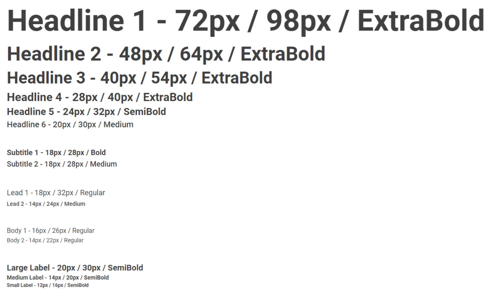

# Capítulo IV: Product Design
En este capítulo describimos las directrices de diseño y estilo para el producto, asegurando una experiencia visual coherente y atractiva para el usuario.

## 4.1. Style Guidelines.
En esta sección se describen las pautas generales de estilo que guían la apariencia visual del producto, incluyendo el uso de colores, tipografía y espaciado.

### 4.1.1. General Style Guidelines.
Las directrices generales aseguran una estética que refuerza la marca y proporciona claridad visual para los usuarios.

#### Historia de la marca
La marca busca transmitir modernidad y profesionalismo, reflejando estos valores en cada elemento visual del diseño.

#### Misión
Proporcionar a los usuarios una experiencia fluida y atractiva, con interfaces claras y consistentes.

#### Visión
Ser reconocidos como una marca que combina funcionalidad y estilo en el diseño de productos digitales.

#### Brand Name
El nombre de la marca es un elemento clave de nuestra identidad, representando los valores fundamentales de la empresa.

#### Colores
La paleta de colores está diseñada para proporcionar un equilibrio visual. Utilizamos una combinación de tonos brillantes y neutros para transmitir profesionalismo y modernidad.

#### Tipografía
Usamos la tipografía **Roboto** en diferentes pesos para establecer jerarquía visual y garantizar una legibilidad óptima. El color de la letra principal es `#404040`.

#### Espaciado
El espaciado entre elementos visuales asegura una estructura clara y organizada, ayudando a los usuarios a navegar por el contenido de forma fluida.

- **Tamaño de letra**: Las fuentes varían desde 12px hasta 98px según la jerarquía del texto.
- **Interlineado**: Mantenemos un interlineado proporcional para mejorar la legibilidad.

### 4.1.2. Web Style Guidelines.
Las pautas de estilo para la web están diseñadas para asegurar que el diseño sea funcional y atractivo tanto en dispositivos móviles como en pantallas grandes. Incluir consistencia en colores, tipografías y espaciado es clave para mantener la identidad visual en todas las plataformas.

## 4.2. Information Architecture.
.

### 4.2.1. Organization System.

.

### 4.2.2. Labeling System.

.

### Etiquetas:

 

### 4.2.3. SEO Tags and Meta Tags.

.

### Para la landing page.

### 4.2.4. Searching Systems.

.

### 4.2.5. Navigation Systems.
.

## 4.3. Landing Page UI Design.

<td align="center">
En esta sección, presentamos el diseño de la interfaz de usuario
de la landing page para GoUni. El diseño se ha desarrollado teniendo
en cuenta la experiencia del usuario y la accesibilidad tanto en
versiones de escritorio como móviles. El objetivo principal es
proporcionar una navegación clara y atractiva. </td>

### 4.3.1. Landing Page Wireframe.
<td align="center">
A continuación, mostramos los wireframes de la landing page, 
los cuales representan la estructura básica y el layout sin 
elementos gráficos detallados. Estos sirven como una guía inicial
para el diseño visual, asegurando que todos los elementos
necesarios estén presentes y correctamente organizados.
</td>

Enlace a los wireframes de la Landing Page en Figma:

[Landing Page Wireframes Link](https://www.figma.com/design/wsF29U5csRMNSNzzX1BfIR/Landing-Page-Wireframe-GoUni?node-id=0-1&t=PrfjiFfYo27WAa3q-1)

#### Wireframe de la Landing Page en Figma:

#### Versión Desktop:

##### Wireframe de la página principal:

Wireframe de la sección Header:

Wireframe de la sección Hero:

Wireframe de la sección How It Works:

Wireframe de la sección Benefits of GoUni:

Wireframe de la sección Security:

Wireframe de la sección Plans:

Wireframe de la sección Our Apps and Portals:

Wireframe de la sección Contact Us:

Wireframe de la sección Footer:

##### Wireframe de la sección Sobre Nosotros:

Wireframe de la sección Header:

Wireframe de la sección Who We Are:

Wireframe de la sección Our Sponsor:

Wireframe de la sección whyGoUni?:

Wireframe de la sección Our Team:

Wireframe de la sección Footer:

##### Versión Mobile:

##### Wireframe de la página principal:

Wireframe de la sección Header:

Wireframe de la sección How It Works:

Wireframe de la sección Benefits of GoUni:

Wireframe de la sección Security:

Wireframe de la sección Plans:

Wireframe de la sección Our Apps and Portals:

Wireframe de la sección Contact Us:

Wireframe de la sección Footer:

##### Wireframe de la sección Sobre Nosotros:

Wireframe de la sección Header:

Wireframe de la sección Why GoUni?:

Wireframe de la sección Our Sponsors:

Wireframe de la sección Our Team:

Wireframe de la sección Footer:

### 4.3.2. Landing Page Mockup.
<td align="center">
Esta sección presenta los mockups de la landing page,
que ilustran el diseño final con detalles gráficos, tipografía,
y color. Los mockups son fundamentales para visualizar cómo se
verá la página final y para realizar ajustes antes del desarrollo.
</td>

Enlace a la mockup de la Landing Page en Figma:

#### Mockups de la Landing Page en Figma:

##### Versión Desktop:

#### Mockups de la página principal

Mockup de la sección Header:

Mockup de la sección Hero:

Mockup de la sección How It Works:

Mockup de la sección Benefits of GoUni:

Mockup de la sección Security:

Mockup de la sección Plans:

Mockup de la sección Our Apps and Portals:

Mockup de la sección Contact Us:

Mockup de la sección Footer:

#### Mockups de la sesion Sobre Nosotros:

Mockup de la sección Header:

Mockup de la sección Who We Are:

Mockup de la sección Why GoUni?:

Mockup de la sección Our Sponsors:

Mockup de la sección Our Team:

Mockup de la sección Footer:

##### Versión Mobile:

#### Mockups de la página principal

Mockup de la sección Header:

Mockup de la sección How It Works:

Mockup de la sección Benefits of GoUni:

Mockup de la sección Security:

Mockup de la sección Plans:

Mockup de la sección Our Apps and Portals:

Mockup de la sección Contact Us:

Mockup de la sección Footer:

##### Mockups de la sesion Sobre Nosotros:

Mockup de la sección Header:

Mockup de la sección Why GoUni?:

Mockup de la sección Our Sponsors:

Mockup de la sección Our Team:

Mockup de la sección Footer:

## 4.4. Web Applications UX/UI Design
.

### 4.4.1. Web Applications Wireframes
.

### 4.4.2. Web Applications Wireflow Diagrams

Enlace a traves de la herramienta LucidChart:

.

### 4.4.3. Web Applications Mock-ups
.

### Mock-ups versión Desktop:
#### Mock-ups de la página principal

Enlace a la mockup de la App Web en Figma:

### 4.4.4 Web Applications User Flow Diagrams.

Enlace de los User Flow Diagrams en LucidChart:

## 4.5. Web Applications Prototyping.

### 4.6.3. Software Architecture Component Diagram.

## 4.7. Software Object-Oriented Design
### 4.7.1. Class Diagrams

### 4.7.2. Class Dictionary

 

## 4.8. Database Design

### 4.8.1. Database Diagram

A continuación se detalla el modelo físico realizado para esta entrega, donde se consideró los requerimientos necesarios para el negocio.

