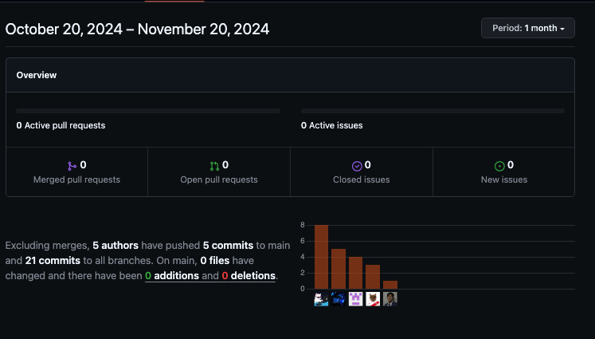

# [**Capítulo V: Product Implementation, Validation & Deployment.**](#capítulo-v-product-implementation-validation--deployment)

## [**5.1. Software Configuration Management.**](#software-configuration-management)

En la sección siguiente, se describirán las herramientas, convenciones, referencias y configuraciones utilizadas durante el desarrollo del proyecto, las cuales ayudaron a mantener la coherencia en el trabajo realizado.

### [**5.1.1. Software Development Environment Configuration.**](#software-development-environment-configuration)

En esta parte, se mencionarán los distintos programas de software que el equipo de desarrollo utilizó para llevar a cabo las tareas relacionadas con la creación del proyecto.

 

**Project Management**

- **Trello**: <https://trello.com/>  
  La plataforma de Trello se empleó para la gestión de las tareas y la organización del flujo del trabajo en el proyecto. Las tareas se presentaron dentro de tarjetas en listas con el integrante encargado de realizarlas. Además, utilizamos funcionalidades como agregar etiquetas de colores y marcar el proceso de las tareas. De esta manera, pudimos hacer seguimiento a nuestros avances en el proyecto.

- **Notion**: <https://www.notion.so/>  
  Notion fue utilizado para la colaboración del equipo en el proyecto. Se crearon calendarios y listas con las fechas de las reuniones del equipo. Además, se usaron herramientas como comentarios y menciones para fomentar el trabajo y la colaboración en equipo.

**Requirements Management**

- **Trello**: <https://trello.com/>  
  Trello se empleó para organizar los requisitos de la aplicación. En él se gestionó el product backlog, ordenado según la prioridad aplicando Fibonacci para enumerar las historias de usuario, y en otra sección organizándolas según las épicas.

**Product UX/UI Design**

- **Figma**: <https://www.figma.com/>  
  Figma nos ayudó a desarrollar los wireframes, mockups y prototipos de la aplicación móvil.

- **Miro**: <https://miro.com/es/>  
  Miro fue de utilidad para realizar los As-Is Scenario Mapping y To-Be Scenario Mapping para cada uno de los segmentos objetivos.

- **UXPressia**: <https://uxpressia.com/>  
  UXPressia se empleó para la creación de User Personas, Empathy Maps, Journey Maps e Impact Maps. Usamos plantillas de UXPressia para elaborar cada una de estas herramientas, permitiendo exportar el trabajo realizado para incluirlo en el proyecto.

**Software Development**

- **Landing Page**  
  Para el desarrollo de la landing page se utilizaron HTML5, CSS y JavaScript.

- **Frontend Web Application**  
  Para la aplicación web frontend, se utilizó Angular como framework de JavaScript, junto con PrimeNG para componentes UI reutilizables. El stack tecnológico incluye Java con Spring Boot, HTML, Angular, JavaScript, CSS y una base de datos MySQL.

**Software Testing**

Para las pruebas funcionales de la Landing Page y la aplicación web, se utilizaron herramientas de desarrollo de navegadores web como Google Chrome (<https://www.google.com/chrome/>), Microsoft Edge (<https://www.microsoft.com/en-us/edge>) y Mozilla Firefox (<https://www.mozilla.org/en-US/firefox/browsers/>).

**Software Deployment**

- **Netlify**: <https://www.netlify.com/>  
  Para el despliegue de la Landing Page, se conectó el repositorio de GitHub con Netlify. Esto permitió que Netlify gestionara automáticamente la implementación cada vez que se actualizó el repositorio.

**Software Documentation**

- **Google Drive**: <https://www.google.com/intl/es-419_pe/drive/>  
  Google Drive se utilizó para crear documentos mediante Google Docs, permitiendo trabajar colaborativamente en los informes de las entregas.

- **Structurizr**: <https://structurizr.com/>  
  Herramienta empleada para crear diagramas C4 (contexto, contenedor y componentes) utilizando una sintaxis similar a un lenguaje de programación.

- **GitHub**: <https://github.com/>  
  GitHub se usó para la creación de la documentación y la Landing Page, gracias a sus capacidades para el trabajo colaborativo.

### [**5.1.2. Source Code Management.**](#source-code-management)

La administración y estructuración de las múltiples modificaciones se realizaron mediante la creación de un repositorio en GitHub para el proyecto. Nuestra organización se estructuró de la siguiente manera:

**Organización:**  
<https://github.com/Open-Source-SW53-Group-2>

- **Repositorio de la Landing Page:**  
  <https://github.com/Open-Source-SW53-Group-2/Landing-Page>

Para mejorar el control sobre la creación de ramas y la implementación de cambios en el código fuente, se utilizó Gitflow. Se establecieron dos ramas principales: `main` y `develop`.

**Ramas principales:**

- **Rama `main`:**  
  Contiene las versiones oficiales del repositorio, listas para ser desplegadas en producción.

- **Rama `develop`:**  
  Funciona como el punto de integración para las ramas de `feature`. Una vez que el `head` de esta rama sea estable y listo para el lanzamiento, se fusionará con la rama `release`.

**Ramas auxiliares:**

- **Rama `release`:**  
  Se utiliza para la preparación del lanzamiento de una nueva versión en la rama `main`. Ayuda a controlar las versiones de código al permitir solucionar errores menores y preparar los datos para la versión final. Esto libera a la rama `develop` de tareas de preparación y evita demoras en el desarrollo mientras se alista el lanzamiento.

- **Rama `feature`:**  
  En estas ramas se desarrollan las nuevas funcionalidades que luego se integrarán en la rama `develop`. Estas características incluyen funcionalidades solicitadas por los usuarios tanto en la página de inicio como en la aplicación web. Por ejemplo, la rama `feature/navbar`.

- **Rama `hotfix`:**  
  Se utiliza para corregir urgentemente errores en la última versión de la rama `main` que no pueden esperar hasta el próximo lanzamiento para ser solucionados.

### [**5.1.3. Source Code Style Guide & Conventions.**](#source-code-style-guide--conventions)

- Utilizaremos el lenguaje de etiquetas **HTML** para el desarrollo principal de nuestra Landing Page.
- Utilizaremos el lenguaje **CSS** para aplicar los estilos a la estructura de nuestra Landing Page.
- Implementaremos el lenguaje **JavaScript** para añadir funcionalidades a nuestra Landing Page.
- Utilizaremos el lenguaje **Gherkin** para diseñar pruebas de cada historia de usuario, siguiendo su estructura básica.

---

#### **Convenciones de Commits**

Nuestro equipo sigue las **Conventional Commits** en su versión 1.0.0 (disponible en [conventionalcommits.org](https://www.conventionalcommits.org/en/v1.0.0/)) para garantizar claridad y coherencia en los registros. La estructura es la siguiente:

**Formato:**  
`<type>[scope opcional]: <description>`

- **type:** Indica el tipo de modificación realizada, con opciones como `feat` (nueva funcionalidad), `fix` (corrección de errores), `docs` (documentación), etc.
- **scope (opcional):** Define el alcance del cambio realizado en el código (e.g., un módulo o componente específico).
- **description:** Ofrece un resumen conciso de los cambios implementados.

---

#### **Convenciones de Versionado de Lanzamientos**

Seguimos el estándar **Semantic Versioning 2.0.0**, en el cual las versiones se presentan como `X.Y.Z`, con las siguientes interpretaciones:

- **X (Major):**  
  Incrementa con cambios incompatibles con versiones anteriores. Comienza en `0` durante el desarrollo inicial y pasa a `1` cuando el proyecto está listo para su lanzamiento público.  
  _Nota:_ Al aumentar `X`, los valores de `Y` y `Z` se reinician a `0`.

- **Y (Minor):**  
  Incrementa con cambios compatibles que agregan nuevas funcionalidades, generalmente provenientes de ramas `release`.  
  _Nota:_ Al aumentar `Y`, el valor de `Z` se reinicia a `0`.

- **Z (Patch):**  
  Incrementa con correcciones de errores menores, integrando commits realizados en ramas de corrección (`hotfix`) que se fusionan con la rama principal.

Este enfoque asegura que las versiones del proyecto sean claras y fácilmente interpretables por todos los miembros del equipo y usuarios finales.

### [**5.1.4. Software Deployment Configuration.**](#software-deployment-configuration)

Para configurar el despliegue del proyecto, seguimos los pasos detallados a continuación utilizando **Vercel** como plataforma:

1. **Entrar a Vercel y seleccionar la opción "Import an existing project"**  
   

2. **Seleccionar la opción "Deploy with GitHub"**  
   

3. **Seleccionar la organización y el repositorio del proyecto**  
   Dentro de la organización, buscar y seleccionar el repositorio del proyecto que se desea desplegar en producción.

4. **Agregar la información necesaria para el despliegue**  
   Proporcionar los datos requeridos por la plataforma, como configuraciones específicas o variables de entorno si es necesario.

5. **Presionar el botón de despliegue**  
   Finalmente, hacer clic en el botón correspondiente al nombre del proyecto para iniciar el proceso de despliegue.

---

#### **Enlace de la Landing Page:**

[**https://landing-page-with-angular-sigma.vercel.app/home**](https://landing-page-with-angular-sigma.vercel.app/home)

## [**5.2. Landing Page, Services & Applications Implementation.**](#landing-page-services--applications-implementation)

### [**5.2.1. Sprint 1.**](#sprint-1)

En esta sección se registra y explica el avance en términos de producto y trabajo colaborativo para el **Sprint 1**, enfocado en el desarrollo de la landing page. Se detalla el progreso tangible y funcional, incluyendo su diseño, desarrollo y funcionalidades implementadas, así como la colaboración del equipo, los métodos de comunicación utilizados y las herramientas empleadas para garantizar una cooperación efectiva. Además, se incluye información sobre la planificación del sprint, el backlog de tareas, evidencia del desarrollo, documentación de servicios utilizados y reflexiones sobre la colaboración del equipo, proporcionando una visión completa del progreso alcanzado.

---

#### [**5.2.1.1. Sprint Planning 1.**](#sprint-planning-1)

En el **Sprint Planning 1**, se presenta evidencia de la planificación e implementación de la landing page, incluyendo avances del proyecto y aprendizajes de colaboración en equipo registrados en **GitHub**.

| **Sprint #**                 | Sprint 1                                                                          |
|------------------------------|-----------------------------------------------------------------------------------|
| **Sprint Planning Background** |                                                                                   |
| **Date**                     | 30 de agosto de 2024                                                              |
| **Time**                     | 22:00 horas (GMT-5)                                                               |
| **Location**                 | Modalidad remota                                                                  |
| **Prepared By**              | StudentConnect                                                                    |
| **Attendees (to planning meeting)** | Todos los miembros de StudentConnect                                            |
| **Sprint 0 Review Summary**  | Debido a que es el primer sprint, no hay review summary de un sprint anterior.    |
| **Sprint 1 Retrospective Summary** | En este Sprint se planea desarrollar el landing page con HTML y CSS3. Previamente, el landing page se diseñó en Figma. El grupo discutió cómo diseñar el landing, implementar imágenes y todo lo referente a la interfaz. Al finalizar este sprint, el landing page estará desplegado en Netlify, permitiendo el acceso público al proyecto. |
| **Sprint Goal & User Stories** |                                                                                   |
| **Sprint Goal 1**            | El objetivo de este sprint es el desarrollo y despliegue de la aplicación frontend.|
| **Sprint Velocity 1**        | 8                                                                                 |
| **Sum of Story Points**      | 36                                                                                |

---

#### [**5.2.1.2. Sprint Backlog 1.**](#sprint-backlog-1)

En esta parte mostramos las tareas que se realizaron en este sprint.

**Link del Trello:**  
<https://trello.com/b/4BqoJyJj>

**Vista del Sprint Backlog en Trello:**  

---

| **Sprint #**   | **Sprint 1**                                                                                                                                                                                                                  |     |     |     |     |     |     |
|-----------------|----------------------------------------------------------------------------------------------------------------------------------------------------------------------------------------|-----|-----|-----|-----|-----|-----|
| **User Story**  | **Work-item / Task**                                                                                                                                                                                                         |     |     |     |     |     |     |
| **ID**         | **Title**                        | **Id** | **Title**                        | **Description**                                                                       | **Estimation (hours)** | **Assigned To**    | **Status (To-do / In-Process / To-Review / Done)** |
| **E5-US01**     | Barra de navegación en la landing page | **T1** | Navbar section                  | Implementar navbar con botón (redirige a la aplicación) y responsive design           | 1h                    | Joan Talizo        | Done                                              |
| **E5-US02**     | Dirigirse a la aplicación mediante el landing page | **T2** | Button Call to Action         | Implementar el button Call to Action del navbar                                       | 0.1h                  | Joan Talizo        | Done                                              |
| **E5-US03**     | Sección hero del landing page   | **T3** | Navbar section responsive       | Aplicar diseño responsive a las opciones del navbar                                   | 1h                    | Joan Talizo        | Done                                              |
| **E5-US03**     | Sección hero del landing page   | **T4** | Hero section                    | Implementar un hero section                                                          | 1h                    | Angel Anampa       | Done                                              |
| **E5-US03**     | Sección hero del landing page   | **T5** | Responsive design hero section  | Aplicar design responsive al hero section                                             | 1h                    | Angel Anampa       | Done                                              |
| **E5-US03**     | Sección hero del landing page   | **T6** | Product section and items       | Implementar Product section y los ítems característicos en orden grid                | 1h                    | Alessandro David   | Done                                              |
| **E5-US03**     | Sección hero del landing page   | **T7** | Responsive design Product section | Implementar diseño responsive a Product section                                       | 1h                    | Alessandro David   | Done                                              |
| **E5-US03**     | Sección hero del landing page   | **T8** | Customers section and items     | Implementar Customers section y los ítems característicos en orden grid y aplicar animaciones | 1.5h                  | Joan Talizo        | Done                                              |
| **E5-US03**     | Sección hero del landing page   | **T9** | Responsive design Customers section | Implementar diseño responsive a Customers section                                     | 1h                    | Joan Talizo        | Done                                              |
| **E5-US03**     | Sección hero del landing page   | **T10** | Pricing section                | Implementar Pricing section y los ítems característicos en orden grid                | 1h                    | Samuel Valera      | Done                                              |
| **E5-US03**     | Sección hero del landing page   | **T11** | Responsive design Pricing section | Implementar diseño responsive a Pricing section                                       | 1h                    | Samuel Valera      | Done                                              |
| **E5-US03**     | Sección hero del landing page   | **T12** | Contact section                | Implementar Contact section y los ítems característicos en orden grid                | 1h                    | Samuel Valera      | Done                                              |
| **E5-US03**     | Sección hero del landing page   | **T13** | Responsive design Contact section | Implementar diseño responsive a Contact section                                       | 1h                    | Samuel Valera      | Done                                              |
| **E5-US03**     | Sección hero del landing page   | **T14** | Footer section                 | Implementar footer section                                                           | 1h                    | Alessandro David   | Done                                              |
| **E5-US03**     | Sección hero del landing page   | **T15** | Social media section            | Implementar icons para las redes sociales y también links                            | 0.5h                  | Alessandro David   | Done                                              |
| **E5-US03**     | Sección hero del landing page   | **T16** | Responsive design footer section | Aplicar diseño responsive                                                            | 1h                    | Angel Anampa       | Done                                              |
| **E5-US04**     | Versión en español de landing page | **T17** | Switch que activa I18n         | Button de tipo switch que permite cambiar de idioma a la landing                     | 0.5h                  | Angel Anampa       | Done                                              |

#### [**5.2.1.3. Development Evidence for Sprint Review.**](#development-evidence-for-sprint-review)

En esta sección, se presentan los commits realizados en el repositorio de la landing page en GitHub. Estos commits reflejan el progreso y las mejoras implementadas durante el Sprint 1, proporcionando una visión detallada de las actividades de desarrollo y las contribuciones del equipo.

**Repositorio de la Landing Page:**  
[https://github.com/Open-Source-SW53-Group-2/Landing-Page](https://github.com/Open-Source-SW53-Group-2/Landing-Page)

---

| **Repository**                                                                                 | **Branch** | **Commit Id**                          | **Commit Message**                                                                                                                                                                                                                                                | **Commit Message Body** | **Committed on (Date)** |
|-------------------------------------------------------------------------------------------------|------------|----------------------------------------|--------------------------------------------------------------------------------------------------------------------------------------------------------------------------------------------------------------------------------------------------------------------|-------------------------|-------------------------|
| [Landing Page](https://github.com/Open-Source-SW53-Group-2/Landing-Page)                      | `main`     | `85a4580a83496e87b175a9156aa975766a111bc0` | [feat: add feature for contact us](https://github.com/Open-Source-SW53-Group-2/Landing-Page/commit/85a4580a83496e87b175a9156aa975766a111bc0 "feat: add feature for contact us")                                                                                     | -                       | 5 Sep, 2024            |
|                                                                                                 |            | `7c08720d286366b3ba29a5e549cc3989e2289315` | [feat: Add section header and footer](https://github.com/Open-Source-SW53-Group-2/Landing-Page/commit/7c08720d286366b3ba29a5e549cc3989e2289315 "feat: Add section header and footer")                                                                             | -                       | 3 Sep, 2024            |
|                                                                                                 |            | `26d2ae5b401080a35c4a334bb85e4960b8613320` | [Added Security & Plans sections](https://github.com/Open-Source-SW53-Group-2/Landing-Page/commit/26d2ae5b401080a35c4a334bb85e4960b8613320 "Added Security & Plans sections")                                                                                      | -                       | 3 Sep, 2024            |
|                                                                                                 |            | `93c310cf2cbc618191efabb2a57ed6982673fd2b` | [feat: add feature for Sponsors](https://github.com/Open-Source-SW53-Group-2/Landing-Page/commit/93c310cf2cbc618191efabb2a57ed6982673fd2b "feat: add feature for Sponsors")                                                                                         | -                       | 5 Sep, 2024            |
|                                                                                                 |            | `25a342d4724b23e717cc53a2da7c6d8d16634e74` | [added the GoUni benefits section from the landing page](https://github.com/Open-Source-SW53-Group-2/Landing-Page/commit/25a342d4724b23e717cc53a2da7c6d8d16634e74 "added the GoUni benefits section from the landing page")                                       | -                       | 31 Aug, 2024           |
|                                                                                                 |            | `f5dd736d2eef4a7bc4da54b8440d5ba2424af5a1` | [feat: add feature for ourApp & Portals](https://github.com/Open-Source-SW53-Group-2/Landing-Page/commit/f5dd736d2eef4a7bc4da54b8440d5ba2424af5a1 "feat: add feature for ourApp & Portals")                                                                        | -                       | 5 Sep, 2024            |
|                                                                                                 |            | `e1b3f6e704345ff630756a9b8d9717350d6c6f25` | [added ourTeam section](https://github.com/Open-Source-SW53-Group-2/Landing-Page/commit/e1b3f6e704345ff630756a9b8d9717350d6c6f25 "added ourTeam section")                                                                                                         | -                       | 1 Sep, 2024            |
|                                                                                                 |            | `247984804611109729a44ce0b5a81d9020eda4e5` | [Add "Who We Are" and "Why GoUni?" sections with corresponding content and styles](https://github.com/Open-Source-SW53-Group-2/Landing-Page/commit/247984804611109729a44ce0b5a81d9020eda4e5 "Add \"Who We Are\" and \"Why GoUni?\" sections with corresponding content and styles") | -                       | 5 Sep, 2024            |

---

#### [**5.2.1.4. Testing Suite Evidence for Sprint Review.**](#testing-suite-evidence-for-sprint-review)

En este sprint, se han incorporado pruebas de aceptación escritas en **Gherkin**, asegurando que los requisitos del usuario se validen de manera efectiva. A continuación, se proporciona el enlace al repositorio de las pruebas de aceptación, donde se encuentra una descripción detallada de los escenarios de prueba y su implementación:

**Repositorio de pruebas de aceptación:**  
[https://github.com/Open-Source-SW53-Group-2/studentconnect-acceptance-test](https://github.com/Open-Source-SW53-Group-2/studentconnect-acceptance-test)

---

| **Repository**                                                                                | **Branch** | **Commit Id**                          | **Commit Message**                                                                                                                                                                    | **Commit Message Body** | **Committed on (Date)** |
|----------------------------------------------------------------------------------------------|------------|----------------------------------------|----------------------------------------------------------------------------------------------------------------------------------------------------------------------------------------|-------------------------|-------------------------|
| [Student Connect Acceptance Test](https://github.com/Open-Source-SW53-Group-2/studentconnect-acceptance-test) | `main`     | `109397e2e2a2361e101ec1a4250ff2c4041f4eb5` | [feat: Add acceptance test](https://github.com/Open-Source-SW53-Group-2/studentconnect-acceptance-test/commit/109397e2e2a2361e101ec1a4250ff2c4041f4eb5 "feat: Add acceptance test")       | -                       | 05 Sep, 2024           |
|                                                                                              |            | `b38f24bb4f70ae31ffdfc21e47149af91c033fd8` | [chore: add AT02.feature file](https://github.com/upc-pre-202401-si729-sw51-the-coders/upc-pre202401-si729-sw51-the-coders-acceptance-tests/commit/a571cd6c5c30a97bdf55086df2256f8e543ce0bd) | -                       | 05 Sep, 2024           |
|                                                                                              |            | `2822407798d69e79059a55296cdd82b14257381e` | [chore: add AT03.feature file](https://github.com/upc-pre-202401-si729-sw51-the-coders/upc-pre202401-si729-sw51-the-coders-acceptance-tests/commit/a571cd6c5c30a97bdf55086df2256f8e543ce0bd) | -                       | 05 Sep, 2024           |
|                                                                                              |            | `e62e30e01e229f7dfda1939f96278bf7d1a6ec16` | [chore: add AT04.feature file](https://github.com/upc-pre-202401-si729-sw51-the-coders/upc-pre202401-si729-sw51-the-coders-acceptance-tests/commit/a571cd6c5c30a97bdf55086df2256f8e543ce0bd) | -                       | 05 Sep, 2024           |
|                                                                                              |            | `26897e7664a9f74ac2109178c74c8835f4081031` | [chore: add AT5.feature file](https://github.com/upc-pre-202401-si729-sw51-the-coders/upc-pre202401-si729-sw51-the-coders-acceptance-tests/commit/a571cd6c5c30a97bdf55086df2256f8e543ce0bd) | -                       | 05 Sep, 2024           |

---

#### [**5.2.1.5. Execution Evidence for Sprint Review.**](#execution-evidence-for-sprint-review)

En este sprint logramos, como primera fase de nuestro producto final, desarrollar nuestra landing page usando HTML y CSS. También se implementó un diseño responsive para dispositivos Android e iOS, y su respectivo despliegue se realizó en **Netlify**.

---

#### [**5.2.1.6. Services Documentation Evidence for Sprint Review.**](#services-documentation-evidence-for-sprint-review)

En el alcance del Sprint 1 se logró desarrollar la landing page, por lo que no se evidencia el empleo de web services.

---

#### [**5.2.1.7. Software Deployment Evidence for Sprint Review.**](#software-deployment-evidence-for-sprint-review)

Durante el primer sprint, desarrollamos y desplegamos la landing page del proyecto. El despliegue lo llevó a cabo uno de nuestros integrantes (Abraham), ya que el proceso no tomaba más de cinco minutos. Utilizamos **Netlify** como plataforma de despliegue, realizando varias pruebas en la rama "develop" antes de proceder con la rama "main".

**Pasos para el despliegue:**

1. Creación de cuenta en **Netlify**.
2. Selección de la opción "Add new website" para elegir el proyecto a desplegar.

   

3. Selección de la rama "main" y clic en el botón "Deploy".

   

---

#### [**5.2.1.8. Team Collaboration Insights during Sprint.**](#team-collaboration-insights-during-sprint)

**Distribución de aportes en el informe:**  
El desarrollo del informe se organizó dividiendo el repositorio por capítulos. Cada integrante realizó aportes específicos, distribuidos como se muestra en la siguiente tabla y las capturas incluidas.

**URL del repositorio para el Project Report:**  
<https://github.com/Open-Source-SW53-Group-2/Report>

| **Integrante** | **Aporte en el informe** |
|----------------|----------------------------------------------------------------------------------------------------------------------------------------------------------------------------------------------------------------------------------------------------------------------------------------------------------------------------------------------------------------------------------------------------------------------------------------------------------------------------------------------------------------------------------------------------------------------------------------------------------------------------------------------------------------------------------------------------------------------------------------------------------------------------------------|
| **Joan**       | Startup Profile, Descripción de la Startup, Solution Profile, Antecedentes y problemática, Lean UX Process, Lean UX Problem Statements, Lean UX Assumptions, Segmentos objetivo, User Stories, Organization Systems, Labeling Systems, SEO Tags and Meta Tags, Searching Systems, Navigation Systems, Landing Page Wireframe, Web Applications Wireframes, Software Architecture Context Diagram, Software Architecture Container Diagrams, Software Architecture Components Diagrams, Class Diagrams, Class Dictionary, Database Diagram, Development Evidence for Sprint Review.  |
| **Franky**     | Competidores, Análisis competitivo, Estrategias frente a competidores, Product backlog, Style guidelines, Web style guidelines, Information architecture, Landing page UI design, Landing page mockup, Web applications mockup, Software deployment configuration, Development Evidence for Sprint Review, Execution Evidence for Sprint Review, Services Documentation Evidence for Sprint Review, Software Deployment Evidence for Sprint Review.  |
| **Angel**      | User task matrix, User journey mapping, As-is scenario mapping, To-be scenario mapping, Wireflow diagrams, Diseño de entrevistas, Análisis de entrevistas, DDD architecture.  |
| **Samuel**     | Registro de entrevistas, Análisis de entrevistas, Software deployment configuration, Development Evidence for Sprint Review, Execution Evidence for Sprint Review, Services Documentation Evidence for Sprint Review, Software Deployment Evidence for Sprint Review.  |
| **Alessandro** | Lean UX Hypothesis Statements, Lean UX Canvas, Diseño de entrevistas, User Personas, Empathy Mapping, Impact Mapping, Domain-Driven Software Architecture, Software Development Environment Configuration, Source Code Management, Source Code Style Guide & Conventions.  |

**Evidencia de los commits:**

Durante este sprint, para proteger la rama "main", creamos una rama "develop". Cada integrante creó una sub-rama "feature" para subir un capítulo del informe siguiendo las convenciones establecidas (**Conventional Commits** y **GitFlow**).

**GitHub Analytics del Sprint 1:**

---

### [5.2.2. Sprint 2](#524-sprint-2)

#### [5.2.2.1. Sprint Planning 2](#5241-sprint-planning-2)

En este **Sprint Planning 2**, se presenta la evidencia de la planificación y desarrollo de la aplicación web. Además, se documentan los avances del proyecto y los insights de colaboración del equipo registrados en **GitHub**.

---

| **Sprint #**                 | Sprint 2                                                                          |
|------------------------------|-----------------------------------------------------------------------------------|
| **Sprint Planning Background** |                                                                                   |
| **Date**                     | 21 de septiembre de 2024                                                          |
| **Time**                     | 22:00 horas (GMT-5)                                                               |
| **Location**                 | Modalidad remota                                                                  |
| **Prepared By**              | StudentConnect                                                                    |
| **Attendees (to planning meeting)** | Todos los miembros de StudentConnect                                            |
| **Sprint 2 Review Summary**  | - Corregir:                                                                      |
|                              |   - Problem Statement                                                            |
|                              |   - Product Backlog                                                              |
|                              |   - Sprint Backlog 1                                                             |
|                              |   - Student Outcome                                                              |
|                              |   - Landing Page (Angular)                                                       |
| **Sprint 2 Retrospective Summary** | En este Sprint se planea desarrollar la aplicación web con Angular y Angular Material. Previamente, se diseñó en Figma. El grupo discutió los mockups necesarios para la landing, organizando su creación en ramas específicas que se unirán posteriormente al `main` branch. Al finalizar este sprint, tanto la landing page como la aplicación web estarán desplegadas, permitiendo acceso a través de un dominio definido. |
| **Sprint Goal & User Stories** |                                                                                   |
| **Sprint Goal 2**            | El objetivo de este sprint se basa en el desarrollo y despliegue de la aplicación frontend. |
| **Sprint Velocity 2**        | 5                                                                                 |
| **Sum of Story Points**      | 36                                                                                |

---

#### [5.2.2.2. Sprint Backlog 2](#5242-sprint-backlog-2)

En esta parte mostramos las tareas que se realizaron en este sprint.

**Link del Trello:**  
<https://trello.com/b/sGfIxRuD/studentconnect-sprint-2>

**Vista del Sprint Backlog 2 en Trello:**  

---

| **Sprint #**                 | **Sprint 2**                           |     |     |     |     |     |     |
|------------------------------|-----------------------------------------|-----|-----|-----|-----|-----|-----|
| **User Story**               | **Work-item / Task**                   |     |     |     |     |     |     |
| **ID**                       | **Title**                              | **Id** | **Title** | **Description** | **Estimation (hours)** | **Assigned To** | **Status (To-do/in-Process/To-Review/Done)** |
| **E3-US01**                  | Registro de usuario                    | T1  | Interfaz de usuario del inicio de registro de cuentas | Implementar interfaz de los formularios para el registro de cuentas | 5 | Samuel | Done |
| **E2-US02**                  | Inicio de sesión                       | T2  | Interfaz de usuario de inicio de sesión | Implementar interfaz de formularios para el inicio de sesión de las cuentas de ambos segmentos como cliente y staff | 2 | Joan | Done |
| **E3-US02**                  | Búsqueda de Viaje Disponible           | T3  | Interfaz de usuario de búsqueda de viajes | Implementar interfaz para buscar sede de viaje | 1 | Angel | Done |
| **E3-US01**                  | Reserva de Viaje                       | T4  | Interfaz de reserva | Implementar la vista de reserva y pago de viaje | 2 | Alessandro | Done |
| **E3-US04**                  | Comunicación con el Conductor          | T5  | Interfaz de usuario para hablar con el conductor | Implementar interfaz para comunicación mediante chat | 8 | Franky Mallma | Done |
| **E3-U06**                   | Calificación y Comentario del Conductor | T6  | Interfaz de usuario para calificar viaje | Implementar interfaz para comentar y calificar mediante estrellas el viaje realizado | 3 | Alessandro | Done |
| **E3-U06**                   | Gestión de reservas                    | T7  | Interfaz del usuario principal para poder ver todas las reservas | Implementar interfaz para la sección de reservas mostrando cada una en una lista | 4 | Joan | Done |
| **E4-01**                    | Visualizar planes de servicio          | T8  | Interfaz para ver los planes | Implementar interfaz para la variedad de planes del servicio | 1 | Samuel | Done |
| **E4-US03**                  | Realizar el pago del plan seleccionado | T9  | Interfaz de pago | Implementar la interfaz para el ingreso de detalles de pago | 5 | Samuel | Done |
| **E5-US01**                  | Barra de navegación en la landing page | T10 | Interfaz de landing page | Implementar la barra de navegación con enlaces y botones en el navbar | 1 | Franky | Done |
| **E5-US02**                  | Dirigirse a la aplicación mediante la landing page | T11 | Interfaz de la aplicación | Implementar botón “Open app” que redirija a la aplicación | 2 | Joan | Done |
| **E5-US03**                  | Sección hero del landing page          | T12 | Section hero en landing page | Implementar la sección hero de la landing con presentación de la app | 3 | Angel | Done |
| **E5-US04**                  | Versión en español de la landing page  | T12 | Botón inglés a español en landing | Implementar la opción para cambiar el idioma a español en la landing page | 4 | Alessandro | Done |
| **E5-US05**                  | Sección about the product y about the team | T13 | Interfaz de sección about product y team | Implementar sección about the product y about the team con acceso desde el navbar | 5 | Franky | Done |

---

#### [5.2.2.3. Development Evidence for Sprint Review](#5243-development-evidence-for-sprint-review)

En esta sección, se presentan los commits realizados en el repositorio de la aplicación web en GitHub. Estos commits reflejan el progreso y las mejoras implementadas durante el **Sprint 2**, proporcionando una visión detallada de las actividades de desarrollo y las contribuciones del equipo.

**Repositorio:**  
[GitHub Repository](https://github.com/Open-Source-SW53-Group-2/frontend)

---

| **Repository**                                                                                | **Branch** | **Commit Id**                         | **Commit Message**                                                                                                                                                          | **Commit Message Body** | **Committed on (Date)** |
|------------------------------------------------------------------------------------------------|------------|---------------------------------------|----------------------------------------------------------------------------------------------------------------------------------------------------------------------------|-------------------------|--------------------------|
| [Frontend](https://github.com/Open-Source-SW53-Group-2/frontend)                             | `main`     | `68d1bab16daa527212f0c68647ef3a786a1f4bcf` | [feat: add ngx-translate and json-server setup](https://github.com/Open-Source-SW53-Group-2/frontend/commit/be23d864e0d71829fd1f86d3796b5a5e2c898169)                       | -                       | Sep 21, 2024            |
| [Frontend](https://github.com/Open-Source-SW53-Group-2/frontend)                             | `main`     | `26f76f6efce5f075919009adf09b06de78d39d35` | [feat: chat design added](https://github.com/Open-Source-SW53-Group-2/frontend/commit/26f76f6efce5f075919009adf09b06de78d39d35)                                             | -                       | Sep 19, 2024            |
| [Frontend](https://github.com/Open-Source-SW53-Group-2/frontend)                             | `main`     | `8f3e5884b1b5fb85f68681e3ccd60a74e8f0d9fc` | [feat: add the booking page](https://github.com/Open-Source-SW53-Group-2/frontend/commit/8f3e5884b1b5fb85f68681e3ccd60a74e8f0d9fc)                                          | -                       | Sep 21, 2024            |
| [Frontend](https://github.com/Open-Source-SW53-Group-2/frontend)                             | `main`     | `a99f47b10ec390c67c3b6fdcdf59cffbdd802ca1` | [feat: add the confirmation of reservations view](https://github.com/Open-Source-SW53-Group-2/frontend/commit/a99f47b10ec390c67c3b6fdcdf59cffbdd802ca1)                    | -                       | Sep 21, 2024            |
| [Frontend](https://github.com/Open-Source-SW53-Group-2/frontend)                             | `main`     | `fcac0fb1cea64c6fb811f80b926b39a3a95a31ab` | [feat: added home](https://github.com/Open-Source-SW53-Group-2/frontend/commit/fcac0fb1cea64c6fb811f80b926b39a3a95a31ab)                                                   | -                       | Sep 21, 2024            |
| [Frontend](https://github.com/Open-Source-SW53-Group-2/frontend)                             | `main`     | `90c3523b69cc0ceac99758bf6314d955b398b2a1` | [feat: updated added section plans](https://github.com/Open-Source-SW53-Group-2/frontend/commit/90c3523b69cc0ceac99758bf6314d955b398b2a1)                                   | -                       | Sep 21, 2024            |
| [Frontend](https://github.com/Open-Source-SW53-Group-2/frontend)                             | `main`     | `96b276d86b0f28ba580cee87708a36cc1310b6b9` | [feat: Add destination cards, adjust layout and pagination, improve button styles](https://github.com/Open-Source-SW53-Group-2/frontend/commit/96b276d86b0f28ba580cee87708a36cc1310b6b9) | -                       | Sep 20, 2024            |
| [Frontend](https://github.com/Open-Source-SW53-Group-2/frontend)                             | `main`     | `5d2191b97f74fccbb08bb1714541ea98afc48bfd` | [feat: added routes and components for maps](https://github.com/Open-Source-SW53-Group-2/frontend/commit/5d2191b97f74fccbb08bb1714541ea98afc48bfd)                         | -                       | Sep 23, 2024            |
| [Frontend](https://github.com/Open-Source-SW53-Group-2/frontend)                             | `main`     | `109595daf03c55364c2be18433f1d0776ef59b6d` | [feat: login&register design added](https://github.com/Open-Source-SW53-Group-2/frontend/commit/109595daf03c55364c2be18433f1d0776ef59b6d)                                   | -                       | Apr 28, 2024            |

---

#### [5.2.2.4. Testing Suite Evidence for Sprint Review](#5244-testing-suite-evidence-for-sprint-review)

En el alcance del **Sprint 2**, se desarrolló el frontend de la aplicación web, por lo que no se evidencia la realización de pruebas de testing específicas durante este sprint.

**Repositorio de pruebas de aceptación:**  
[https://github.com/Open-Source-SW53-Group-2/studentconnect-acceptance-test](https://github.com/Open-Source-SW53-Group-2/studentconnect-acceptance-test)

---

| **Repository**                                                                                | **Branch** | **Commit Id**                         | **Commit Message**                                                                                                                                                                    | **Commit Message Body** | **Committed on (Date)** |
|----------------------------------------------------------------------------------------------|------------|---------------------------------------|----------------------------------------------------------------------------------------------------------------------------------------------------------------------------------------|-------------------------|--------------------------|
| [Student Connect Acceptance Test](https://github.com/Open-Source-SW53-Group-2/studentconnect-acceptance-test) | `main`     | `109397e2e2a2361e101ec1a4250ff2c4041f4eb5` | [feat: Add acceptance test](https://github.com/Open-Source-SW53-Group-2/studentconnect-acceptance-test/commit/109397e2e2a2361e101ec1a4250ff2c4041f4eb5 "feat: Add acceptance test")       | -                       | 20 Sep, 2024            |
|                                                                                              |            | `b38f24bb4f70ae31ffdfc21e47149af91c033fd8` | [chore: add AT02.feature file](https://github.com/upc-pre-202401-si729-sw51-the-coders/upc-pre202401-si729-sw51-the-coders-acceptance-tests/commit/a571cd6c5c30a97bdf55086df2256f8e543ce0bd) | -                       | 20 Sep, 2024            |
|                                                                                              |            | `2822407798d69e79059a55296cdd82b14257381e` | [chore: add AT03.feature file](https://github.com/upc-pre-202401-si729-sw51-the-coders/upc-pre202401-si729-sw51-the-coders-acceptance-tests/commit/a571cd6c5c30a97bdf55086df2256f8e543ce0bd) | -                       | 20 Sep, 2024            |
|                                                                                              |            | `e62e30e01e229f7dfda1939f96278bf7d1a6ec16` | [chore: add AT04.feature file](https://github.com/upc-pre-202401-si729-sw51-the-coders/upc-pre202401-si729-sw51-the-coders-acceptance-tests/commit/a571cd6c5c30a97bdf55086df2256f8e543ce0bd) | -                       | 20 Sep, 2024            |
|                                                                                              |            | `26897e7664a9f74ac2109178c74c8835f4081031` | [chore: add AT5.feature file](https://github.com/upc-pre-202401-si729-sw51-the-coders/upc-pre202401-si729-sw51-the-coders-acceptance-tests/commit/a571cd6c5c30a97bdf55086df2256f8e543ce0bd) | -                       | 20 Sep, 2024            |

---

#### [5.2.2.5. Execution Evidence for Sprint Review](#5245-execution-evidence-for-sprint-review)

En este sprint logramos, como segunda fase de nuestro producto final, desarrollar nuestra aplicación web utilizando **Angular** y **Angular Material**, en conjunto con una API hecha con **JSON Server**.

---

**Muestra de las vistas programadas en Angular para este sprint:**

**Pantallas de Landing Page en Angular:**

  
  
  
  
  
  
  
  
  
  

---

**Pantallas de Frontend en Angular:**

- 
- 
- 
- 
- 
- 
- 
- 
- 
- 
- 
- 
- 
- 
- 
- 
- 
- 
- 
- 
- 
- 
- 
- 
- 
- 
- 
- 
- 

---

**Muestra de la respuesta de nuestra API hecha con JSON Server:**  
(Pendiente incluir imágenes o detalles de las respuestas de la API, si corresponde).

---

#### [5.2.2.6. Services Documentation Evidence for Sprint Review](#5246-services-documentation-evidence-for-sprint-review)

En este sprint utilizamos los servicios básicos **Http** en conjunto con **JSON Server**, lo cual facilitó la construcción de nuestra fake API.

- **Variable de entorno `serverBasePath` apuntando al puerto 3000:**

- **Nuestra clase `BaseService`:**

- **Ejemplo de uso con un endpoint:**

---

#### [5.2.2.7. Software Deployment Evidence for Sprint Review](#5247-software-deployment-evidence-for-sprint-review)

En este sprint 2, continuamos utilizando el servicio de **auto despliegue de Vercel** para garantizar una implementación continua y eficiente de la aplicación web. El proceso de despliegue se mantiene consistente con los pasos previamente establecidos, asegurando una integración fluida y sin interrupciones en el flujo de trabajo. Esto permite que las actualizaciones y mejoras se reflejen de inmediato en la aplicación web, ofreciendo una experiencia optimizada para los usuarios finales.

---

**Proceso de despliegue en Vercel:**

1. Entrar a **Vercel**:  
   

2. Seleccionar la opción **“Deploy con GitHub”**:  
   

3. Seleccionar la organización y buscar el repositorio del proyecto **“cartunn-frontend”** que deseamos subir a producción.

4. Agregar la configuración necesaria para el despliegue:  
   

5. Finalmente, presionar el botón con el nombre del proyecto para desplegar.

---

**Link de la Landing Page:**  
[https://landing-page-with-angular-olive.vercel.app/header](https://landing-page-with-angular-olive.vercel.app/header)

#### [5.2.2.8. Team Collaboration Insights during Sprint](#5238-team-collaboration-insights-during-sprint)

A continuación, se presenta una descripción detallada de cómo el equipo trabajó de manera colaborativa durante este sprint. Esta sección destaca las herramientas y métodos utilizados para fomentar una comunicación efectiva, la coordinación de tareas y la resolución de problemas, asegurando que todos los miembros del equipo estuvieran alineados y comprometidos con los objetivos del sprint.

---

**Distribución de aportes en el informe:**

**URL del repositorio para el Project Report:**  
[https://github.com/Open-Source-SW53-Group-2/Report](https://github.com/Open-Source-SW53-Group-2/Report)

**¿Cómo se han desarrollado las actividades de elaboración del informe?**

Para el desarrollo del informe en este sprint, se dividió el repositorio del informe por capítulos. Cada integrante realizó los siguientes aportes representados en la tabla y captura a continuación:

| **Integrante**  | **Aporte en el informe**                                                                                                                                                                                                 |
|-----------------|-----------------------------------------------------------------------------------------------------------------------------------------------------------------------------------|
| **Joan**        | Mejora continua del Problem Statement, Mejora continua del Diagrama de Clases por bounded context, Mejora continua de user stories, Mejora continua de Class Dictionary.           |
|                 |                                                                                               |
| **Samuel**      | Mejora continua de user stories, Mejora continua del product backlog, Mejora continua de Software deployment configuration, Development & Execution Evidence for Sprint Review.   |
|                 |                                                                                               |
| **Franky**      | Mejora continua de user task matrix, Mejora continua de scenario as-is y to-be, Mejora continua en User Journey Mapping, Mejora continua en wireframe mockup.                     |
| **Angel**       | Mejora continua de user stories, Mejora continua del análisis de entrevistas, Mejora del Software deployment configuration, Development & Execution Evidence for Sprint Review.   |
|                 |                                                                                               |
| **Alessandro**  | Mejora continua de Lean UX Hypotheses Statement, Mejora continua de user stories, Mejora continua de empathy map, Mejora de Software Architecture Diagrams & Configuration.       |
|                 |                                                                                               |

---

**Evidencia de los commits:**

Durante este sprint, se siguió la misma estrategia utilizada en el desarrollo de la landing page. Para proteger la rama `main`, se creó una rama `develop`, y cada integrante creó su propia sub-rama `feature` para subir un capítulo del informe, siguiendo las convenciones previamente establecidas (**Conventional Commit** y **Git Flow**).

---

**GitHub Analytics de nuestro segundo sprint:**

- 
- 

---

### [**5.2.3. Sprint 3.**](#sprint-3)

#### [**5.2.3.1 Sprint Planning 3.**](#sprint-planning-3)

En este sprint planning 3 se presenta la evidencia de la planificación y desarrollo de los servicios web RESTful (backend). Además, se evidenciaron los avances del proyecto e insights de colaboración en el equipo a través de GitHub.

| **Sprint #**                       | Sprint 3                                                                                                                    |
|------------------------------------|------------------------------------------------------------------------------------------------------------------------------|
| **Sprint Planning Background**      |                                                                                                                              |
| **Date**                           | 22 de octubre de 2024                                                                                                        |
| **Time**                           | 22:00 horas (GMT-5)                                                                                                          |
| **Location**                       | Modalidad remota                                                                                                             |
| **Prepared By**                    | StudentConnect                                                                                                               |
| **Attendees (to planning meeting)**| Todos los miembros de StudentConnect                                                                                         |
| **Sprint 3 Review Summary**        | Se desarrolló la corrección del informe del proyecto, además de desarrollar los bounded context en Spring Boot               |
| **Sprint 3 Retrospective Summary** | Se planea terminar de desarrollar las vistas de chat y reseñas en el frontend de la aplicación, mejorar algunos features mediante el uso de params y queries, empezar con el proceso de construcción de la aplicación de la API hecha con Java en Spring Boot y finalmente implementar un CRUD. |
| **Sprint Goal & User Stories**     |                                                                                                                              |
| **Sprint Goal 3**                  | El goal de este sprint se basa en el desarrollo y despliegue de la aplicación frontend y backend.                            |
| **Sprint Velocity 3**              | 5                                                                                                                            |
| **Sum of Story Points**            | 40                                                                                                                           |

#### [**5.2.3.2. Sprint Backlog 3.**](#5212-sprint-backlog-3)

En esta parte mostramos las tareas que se realizaron en este sprint.

Link del Trello: [https://trello.com/b/EI5qcpdU](https://trello.com/b/EI5qcpdU)

Vista del Sprint Backlog 3 en Trello:

| **Sprint #**      | **Sprint 3**            |           |            |           |           |           |           |
|-------------------|-------------------------|-----------|------------|-----------|-----------|-----------|-----------|
| **User Story**    | **Work-item / Task**    |           |           |           |           |           |           |
| **ID**            | **Title**               | **Id**    | **Title** | **Description**                                                 | **Estimation (hours)** | **Assigned To**        | **Status (To-do/in-Process/To-Review/Done)** |
| E1-US03           | Evaluar la seguridad del viaje | T1  | Sección de reseñas de conductores | Agregar una tabla con información de las reseñas de los conductores | 3                       | Joan Talizo           | Done |
| E2-US02           | Verificación de identidades     | T1  | Sección de login               | Inicio de sesión de estudiante y conductor                        | 3                       | Angel Anampa          | Done |
| E4-US03           | Registro de usuario             | T1  | Secciones de registro           | Registro de estudiante y conductor                                | 3                       | Franky Mallma         | Done |
| E3-US03           | Reserva de viajes               | T1  | Sección de reserva de viajes    | Agregar tabla con información para mostrar y eliminar reservas    | 5                       | Samuel                | Done |
| E4-US04           | Verificación de identidades     | T2  | API Endpoint para el manejo y demostración de información de los productos | Implementar bounded context de IAM para la credencial de usuarios | 6 | Alessandro | Done |
| E6-US07           | Información de los conductores  | T1  | API Endpoint para el manejo y demostración de información de los conductores | Implementar bounded context de Driver para la información de los conductores | 6 | Joan Talizo | Done |
| E6-US03           | Información de perfil           | T1  | API Endpoint para el manejo y demostración de información de perfil de usuario | Implementar el bounded context Profile donde aparecen la información de usuario | 7 | Angel Anampa | Done |
| E6-US06           | Chat                            | T1  | API Endpoint para el ingresar información de chat | Implementar el bounded context de Chat para conversación             | 6 | Franky Mallma | Done |

#### [**5.2.3.3. Development Evidence for Sprint Review.**](#development-evidence-for-sprint-review)

En esta sección, se presentan los commits realizados en el repositorio de backend en GitHub. Estos commits reflejan el progreso y las mejoras implementadas durante el sprint 2 con respecto a los avances tanto del frontend como del backend, proporcionando una visión detallada de las actividades de desarrollo y las contribuciones del equipo:

[Backend Repository](https://github.com/Open-Source-SW53-Group-2/back-end)

| Repository                                                                 | Branch | Commit Id                               | Commit Message                                                                                           | Commit Message Body | Committed on (Date)      |
|----------------------------------------------------------------------------|--------|-----------------------------------------|----------------------------------------------------------------------------------------------------------|----------------------|--------------------------|
| [https://github.com/Open-Source-SW53-Group-2/back-end](https://github.com/Open-Source-SW53-Group-2/back-end) | -      | 7b7d8846d66432b4a46975d0243e8501f10e76fd | Add shared folder with domain, infrastructure, and interfaces                                             | -                    | 24 Oct, 2024             |
|                                                                            |        | 79486c2ee348f2d68b791268a489267fd7aa541f | feat: Implement ProfilesContextFacade with service integration for profile, driver, and passenger handling | -                    | 24 Oct, 2024             |
|                                                                            |        | 927d034f18ee317b4bfb2caa3d5169fa9849fcfe | fix: implement and inject missing services (ProfileQueryService, DriverQueryService, PassengerQueryService, ReviewCommandService, ReviewQueryService) | -                    | 24 Oct, 2024             |
|                                                                            |        | d3b2e1e02ac032d680b0d6bca0fc37571ecb8c6e | feat: configure IAM for authentication and authorization                                                  | -                    | 23 Oct, 2024             |
|                                                                            |        | 96b21a381406e4db1853bc596966d26a7cd3b53a | chore: removed IAM directory for current delivery                                                         | -                    | 23 Oct, 2024             |

#### [**5.2.3.4. Testing Suite Evidence for Sprint Review**](#5214-testing-suite-evidence-for-sprint-review)

En el alcance del sprint 3 se ha desarrollado el backend de la aplicación web, por lo que haremos algunas pruebas de aceptación con respecto al alcance:

<https://github.com/Open-Source-SW53-Group-2/studentconnect-acceptance-test.git>

| **Repository**                                                                                             | **Branch** | **Commit Id**                          | **Commit Message**              | **Commit Message Body** | **Committed on (Date)** |
|------------------------------------------------------------------------------------------------------------|------------|----------------------------------------|----------------------------------|--------------------------|--------------------------|
| [https://github.com/Open-Source-SW53-Group-2/studentconnect-acceptance-test](https://github.com/Open-Source-SW53-Group-2/studentconnect-acceptance-test) | main       | 0e589899643040d0114ad937b6f93fe372615f40 | chore: add AT06.feature file    | -                        | Oct 24, 2024             |
|                                                                                                            |            | 3a1119825554c4c619ef033666efe8bae1d2a583 | chore: add AT07.feature file    | -                        | Oct 24, 2024             |
|                                                                                                            |            | 643c77a70f5d9986ef41a069be2a3a78178da5d2 | chore: add AT08.feature file    | -                        | Oct 24, 2024             |
|                                                                                                            |            | 22e45675c99b2ff7d0b6708cb603cee7eec414a9 | chore: add AT09.feature file    | -                        | Oct 24, 2024             |
|                                                                                                            |            | c1dc95fb7d8c554fcc741483943f7751d8e9f0c4 | chore: add AT10.feature file    | -                        | Oct 24, 2024             |

#### [5.2.3.5. Execution Evidence for Sprint Review](#5245-execution-evidence-for-sprint-review)

En este sprint, logramos como tercera fase de nuestro producto final, desarrollar la API hecha con Java en Spring Boot.

Muestra de nuestra API hecha con Spring Boot:

Video que ilustra y explica la visualización y navegación logrados en este Sprint:

Link del video: [Ver video](https://upcedupe-my.sharepoint.com/personal/u202218664_upc_edu_pe/_layouts/15/stream.aspx?id=%2Fpersonal%2Fu202218664%5Fupc%5Fedu%5Fpe%2FDocuments%2Fupc%2Dpre%2D202402%2Dsi729%2Dsw53%2Dstudentconnect%2Dabout%2Dthe%2

#### [5.2.3.6. Services Documentation Evidence for Sprint Review](#5246-services-documentation-evidence-for-sprint-review)

Para este sprint, utilizamos los servicios de la API que nosotros mismos hicimos con Java en Spring Boot. A continuación, mostramos todos los endpoints realizados por nuestro equipo por cada Bounded Context correctamente documentados en Swagger.

Repositorio del backend en GitHub: <https://github.com/Open-Source-SW53-Group-2/back-end>

**Bounded Context: Reviews**

| **Entity** | **Endpoint URL** | **Swagger** |
|------------|-------------------|-------------|
| Reviews    | api/v1/reviews    | |

---

**Bounded Context: Profiles**

| **Entity** | **Endpoint URL** | **Swagger** |
|------------|-------------------|-------------|
| Profiles   | api/v1/profiles   |  |

---

**Bounded Context: Drivers**

| **Entity** | **Endpoint URL** | **Swagger** |
|------------|-------------------|-------------|
| Drivers    | api/v1/drivers    |  |

---

**Bounded Context: Roles**

| **Entity** | **Endpoint URL** | **Swagger** |
|------------|-------------------|-------------|
| Roles      | api/v1/roles      |  |

---

**Bounded Context: Students**

| **Entity** | **Endpoint URL** | **Swagger** |
|------------|-------------------|-------------|
| Students   | api/v1/students   |  |

---

**Bounded Context: Chats**

| **Entity** | **Endpoint URL** | **Swagger** |
|------------|-------------------|-------------|
| Chats      | api/v1/chats      |  |

---

**Bounded Context: Users**

| **Entity** | **Endpoint URL** | **Swagger** |
|------------|-------------------|-------------|
| Users      | api/v1/users      |  |

#### [5.2.3.7. Software Deployment Evidence for Sprint Review](#5247-software-deployment-evidence-for-sprint-review)

Link del despliegue: [https://gouniprojectdeploy-production.up.railway.app/swagger-ui/index.html#/](https://gouniprojectdeploy-production.up.railway.app/swagger-ui/index.html#/)

#### [5.2.3.8. Team Collaboration Insights during Sprint](#5238-team-collaboration-insights-during-sprint)

**Distribución de aportes en el informe:**

**URL del repositorio para el Project Report en la organización de GitHub del equipo:** [https://github.com/Open-Source-SW53-Group-2/Report](https://github.com/Open-Source-SW53-Group-2/Report)

**¿Cómo se han desarrollado las actividades de elaboración del informe?**

Para el desarrollo del informe en este sprint, optamos por dividirnos el capítulo de la siguiente manera:

| Integrante  | Aporte en el informe                                                                                                                                                       |
|-------------|----------------------------------------------------------------------------------------------------------------------------------------------------------------------------|
| Angel       | Sprint 3, Development Evidence for Sprint Review, Validation Interviews. ![ref6]                                                                                           |
| Samuel      | Sprint planning 3, Deployment Evidence for Sprint Review, Testing Suite Evidence for Sprint Review, Software Deployment Evidence for Sprint Review, Team Collaboration Insights during Sprint ![ref7] |
| Franky      | Sprint 3, Development Evidence for Sprint Review, Validation Interviews, Mejora continua en Domain Driven Design Architecture, Heuristics evaluation ![ref8]              |
| Alessandro  | Validation Interviews, Development Evidence for Sprint Review ![ref5]                                                                                                      |
| Joan        | Sprint 3, Validation Interviews, Video About-the-product ![ref9]                                                                                                           |

**Evidencia del commit:**

Durante este sprint, al igual que para el desarrollo de la landing page, para proteger la rama “main” creamos una rama “develop” de la que cada integrante de nuestro grupo creó su propia sub-rama “feature” para subir un capítulo del reporte siguiendo las convenciones antes señaladas(conventional commit y git flow).

**Distribución de aportes en nuestra aplicación:**

**Github analytics de nuestro tercer sprint - frontend:**

**Github analytics de nuestro tercer sprint - backend: **

## [**5.2.4 Sprint 4.**](#524-sprint-4)

### [**5.2.4.1 Sprint Planning 4.**](#5241-sprint-planning-4)

En este Sprint Planning 4 se presenta la evidencia de la unión entre el desarrollo de los RESTful Web Services (backend) y el Frontend. Además, se evidenciaron los avances del proyecto y los insights de colaboración en el equipo a través de GitHub.

| **Sprint #**                     | Sprint 4                                |
|----------------------------------|-----------------------------------------|
| **Sprint Planning Background**   |                                         |
| **Date**                         | 12 de noviembre de 2024                 |
| **Time**                         | 22:00 horas (GMT-5)                     |
| **Location**                     | Modalidad remota                        |
| **Prepared By**                  | StudentConnect                          |
| **Attendees (to planning meeting)** | Todos los miembros de StudentConnect |
| **Sprint 4 Review Summary**      | Se desarrolló la comunicación entre Frontend (Angular) y Backend (Spring Boot) |
| **Sprint 4 Retrospective Summary** | Se planea terminar de fusionar las vistas de chat y reseñas en el frontend y backend de la aplicación, mejorando algunas partes de la documentación. |
| **Sprint Goal & User Stories**   |                                         |
| **Sprint Goal 4**                | El objetivo de este sprint se basa en el desarrollo y fusión de la aplicación frontend y backend. |
| **Sprint Velocity 4**            | 5                                       |
| **Sum of Story Points**          | 40                                      |

### [**5.2.4.2 Sprint Backlog 4.**](#5242-sprint-backlog-4)

En esta parte se muestran las tareas que se realizaron en este sprint.

- **Link del Trello**: [Sprint Backlog 4 en Trello](https://trello.com/b/LdfkOWwk)

| Sprint | User Story | Work-item / Task | ID | Title | Descripción | Estimación (horas) | Asignado a | Estado |
| ------ | ---------- | ---------------- | -- | ----- | ----------- | ------------------ | ---------- | ------ |
| Sprint 4 | US-16 | T1 | Seleccionar un plan de servicio | Sección de pagos | Selección entre planes gratis o premium | 4 | Joan Talizo | Done |
| Sprint 4 | US-18 | T1 | Cancelar suscripción o plan | Sección de pagos | Poder cancelar un pago realizado | 4 | Angel Anampa | Done |
| Sprint 4 | US-26 | T1 | Establecer destinos secundarios | Secciones de reservas | Selección de destinos | 3 | Franky Mallma | Done |
| Sprint 4 | US-27 | T1 | Opciones de seguridad adicionales para conductores | Sección mapas | Compartir ubicación en tiempo real | 5 | Samuel | Done |
| Sprint 4 | US-28 | T1 | Identificación de usuarios frecuentes | Sección reseñas | Poder marcar y puntuar a un conductor | 6 | Alessandro | Done |
| Sprint 4 | U-29 | T1 | Programar viajes recurrentes | Sección reservas | Poder reservar viajes recurrentes | 6 | Joan Talizo | Done |

### [**5.2.4.3 Development Evidence for Sprint Review.**](#5243-development-evidence-for-sprint-review)

En esta sección, se presentan los commits realizados en el repositorio de la landing page en GitHub. Estos commits reflejan el progreso y las mejoras implementadas durante el sprint 4 con respecto a los avances tanto del frontend como backend.

- [Repositorio de Frontend](https://github.com/Open-Source-SW53-Group-2/frontend)
- [Repositorio de Backend](https://github.com/Open-Source-SW53-Group-2/back-end)

| **Repository**                                                                                   | **Branch** | **Commit Id**                             | **Commit Message**                              | **Commit Message Body** | **Committed on (Date)** |
|--------------------------------------------------------------------------------------------------|------------|-------------------------------------------|------------------------------------------------|-------------------------|-------------------------|
| [https://github.com/Open-Source-SW53-Group-2/back-end.git](https://github.com/Open-Source-SW53-Group-2/back-end.git) | -          | 00c9b7979ac48031f9335884ea315bff181eadf2 | feat: added endpoint chat                       | -                       | 14 de nov, 2024         |
|                                                                                                  | -          | 36e1db32c0c2b896672466b078254da8e19e3535 | fix: resolve merge conflicts and fix issues in backend integration | -                       | 14 de nov, 2024|
|                                                                                                  | -          | f0726e09c623daaba37a571cc5052109ede78cfe | feat: added endpoint payments                  | -                       | 14 de nov, 2024         |
|                                                                                                  | -          | 3dd9fd180310aeb10e3a6a050c681b1ff55a695d | feat: add the rate driver bounded context      | -                       | 14 de nov, 2024         |
|                                                                                                  | -          | c9407a52d1aac44b528192a80c109f69eca2f96e | fix: resolve entity problems and configuration rate bounded context | -                       | 14 de nov, 2024         |
|                                                                                                  | -          | 7b7d8846d66432b4a46975d0243e8501f10e76fd | Add shared folder with domain, infrastructure, and interfaces | -                       | 14 de nov, 2024         |

### [**5.2.4.4 Testing Suite Evidence for Sprint Review.**](#5244-testing-suite-evidence-for-sprint-review)

In the scope of Sprint 4, the backend of the web application has been developed. Therefore, we will perform some acceptance tests.

- [Acceptance Test Repository](https://github.com/Open-Source-SW53-Group-2/studentconnect-acceptance-test)

| **Repository**                                                                                     | **Branch** | **Commit Id**                              | **Commit Message**             | **Commit Message Body** | **Committed on (Date)** |
|----------------------------------------------------------------------------------------------------|------------|--------------------------------------------|-------------------------------|--------------------------|--------------------------|
| [https://github.com/Open-Source-SW53-Group-2/studentconnect-acceptance-test](https://github.com/Open-Source-SW53-Group-2/studentconnect-acceptance-test) | main       | f8eb76606b6b4a29e5330a65ec64b8d18189eaaf  | chore: add AT11.feature file  | -                        | Nov 13, 2024             |
|                                                                                                    | main       | 5c6198939ff9480ca1fb268d34e32ee2b3de5d31  | chore: add AT12.feature file  | -                        | Nov 13, 2024             |
|                                                                                                    | main       | 1cfc448a60e81a2a1749299912df3af3fb182603  | chore: add AT13.feature file  | -                        | Nov 13, 2024             |
|                                                                                                    | main       | 8b3b8c5bf2abe3b91107baf45becd61855e6d1e6  | chore: add AT14.feature file  | -                        | Nov 13, 2024             |
|                                                                                                    | main       | 57393f7057a6b3913549cf9177a80da8a5b0dc6   | chore: add AT15.feature file  | -                        | Nov 13, 2024             |

## [**5.2.4.5 Execution Evidence for Sprint Review.**](#5245-execution-evidence-for-sprint-review)

Para esta entrega, se realizaron algunos cambios en el frontend según las visitas pendientes. Se puede acceder a la aplicación web mediante el siguiente enlace: [https://landing-page-with-angular-sigma.vercel.app/home](https://landing-page-with-angular-sigma.vercel.app/home). Además, se ha avanzado con el desarrollo final del backend de la aplicación web.

En la landing page se agregaron los videos de About-the-product y About-the-team, para que los visitantes puedan conocer mejor nuestro producto mostrando un video promocional y un video de equipo.

### Muestra de las nuevas secciones en la landing page:

- [Landing Page](https://landing-page-with-angular-sigma.vercel.app/home)

### Muestra de nuestra API hecha con Spring Boot:

La GoUni Platform API ofrece documentación REST para la aplicación. Aquí puedes explorar los endpoints disponibles, incluyendo:

[https://gouniprojectdeploy-production.up.railway.app/swagger-ui/index.html#/](https://gouniprojectdeploy-production.up.railway.app/swagger-ui/index.html#/)

## [**5.2.4.6 Services Documentation Evidence for Sprint Review.**](#5246-services-documentation-evidence-for-sprint-review)

Para este sprint utilizamos los servicios de la API que nosotros mismos hicimos con Java en Spring Boot. A continuación, mostramos todos los endpoints realizados por nuestro equipo por cada Bounded Context correctamente documentados en Swagger.

Se adjunta el link de nuestro backend correctamente desplegado usando el servicio gratuito Railway:  
[https://gouniprojectdeploy-production.up.railway.app/swagger-ui/index.html#/](https://gouniprojectdeploy-production.up.railway.app/swagger-ui/index.html#/)

Repositorio del backend en GitHub:  
[https://github.com/Open-Source-SW53-Group-2/back-end](https://github.com/Open-Source-SW53-Group-2/back-end)

---

### Bounded Context: Authentication

| **Entity**         | **Endpoint URL**             | **Swagger**                                                                                   |
|--------------------|------------------------------|------------------------------------------------------------------------------------------------|
| Authentication     | `api/v1/authentication`      | |

---

### Bounded Context: Payments

| **Entity**         | **Endpoint URL**             | **Swagger**                                                                    |
|--------------------|------------------------------|---------------------------------------------------------------------------------|
| Payments           | `api/v1/payments`            | |

---
### Bounded Context: Reviews

| **Entity**  | **Endpoint URL**      | **Swagger**                                                         |
|-------------|------------------------|----------------------------------------------------------------------|
| Reviews     | `api/v1/reviews`       | |

---

### Bounded Context: Profiles

| **Entity**  | **Endpoint URL**      | **Swagger**                                                         |
|-------------|------------------------|----------------------------------------------------------------------|
| Profiles    | `api/v1/profiles`      | |

---

### Bounded Context: Drivers

| **Entity**  | **Endpoint URL**      | **Swagger**                                                         |
|-------------|------------------------|----------------------------------------------------------------------|
| Drivers     | `api/v1/drivers`       | |

---

### Bounded Context: Roles

| **Entity**  | **Endpoint URL**      | **Swagger**                                                         |
|-------------|------------------------|----------------------------------------------------------------------|
| Roles       | `api/v1/roles`         | |

---

### Bounded Context: Students

| **Entity**  | **Endpoint URL**      | **Swagger**                                                         |
|-------------|------------------------|----------------------------------------------------------------------|
| Students    | `api/v1/students`      | |

---

### Bounded Context: Users

| **Entity**  | **Endpoint URL**      | **Swagger**                                                         |
|-------------|------------------------|----------------------------------------------------------------------|
| Users       | `api/v1/users`         | |

---

### Bounded Context: Chat

| **Entity**  | **Endpoint URL**      | **Swagger**                                                         |
|-------------|------------------------|----------------------------------------------------------------------|
| Chat        | `api/v1/chat`          | |

---

## [**5.2.4.7 Software Deployment Evidence for Sprint Review.**](#5247-software-deployment-evidence-for-sprint-review)

**Link del despliegue:**  
[https://gouniprojectdeploy-production.up.railway.app/swagger-ui/index.html#/](https://gouniprojectdeploy-production.up.railway.app/swagger-ui/index.html#/)

## [**5.2.4.8 Team Collaboration Insights during Sprint.**](#5248-team-collaboration-insights-during-sprint)

**Distribución de aportes en el informe:**

URL del repositorio para el Project Report en la organización de GitHub del equipo: [https://github.com/Open-Source-SW53-Group-2/Report](https://github.com/Open-Source-SW53-Group-2/Report)

**¿Cómo se han desarrollado las actividades de elaboración del informe?**

Para el desarrollo del informe en este sprint se distribuyó los capítulos de esta manera:

| Integrante | Aporte en el informe |
|------------|-----------------------|
| **Angel**  | Sprint 4, Development Evidence for Sprint Review, Team Collaboration Insights during Sprint |
| **Samuel** | Sprint planning 4, Deployment Evidence for Sprint Review, Software Deployment Evidence for Sprint Review, Team Collaboration Insights during Sprint |
| **Franky** | Sprint 4, Development Evidence for Sprint Review, Validation Interviews, Mejora continua en Domain Driven Design Architecture |
| **Alessandro** | Sprint 4, Development Evidence for Sprint Review, Mejora continua en Domain Driven Design Architecture, Team Collaboration Insights during Sprint |
| **Joan**   | Sprint 4, Testing Suite Evidence for Sprint Review, Mejora continua en Domain Driven Design Architecture, Team Collaboration Insights during Sprint |

**Evidencia del commit:**

En este sprint, al igual que en los otros, creamos una rama "developed". Cada miembro del equipo generó su propia sub-rama "feature" desde "developed" para subir su respectivo capítulo del reporte, siguiendo las convenciones establecidas de *conventional commits* y *git flow*.

## [**5.3. Validation Interviews.**](#53-validation-interviews)

Después de avanzar en el desarrollo de la landing page, la aplicación web (frontend) y la API RESTful (backend) del producto GoUni , realizamos entrevistas de validación. Estas entrevistas permitieron a los usuarios de ambos segmentos objetivos obtener una primera impresión del software.

### [**5.3.1. Diseño de Entrevistas.**](#531-diseño-de-entrevistas)

Para realizar los componentes, elaboramos las preguntas para obtener información de nuestros segmentos objetivos mediante las entrevistas.

**Preguntas principales:**

1. ¿Cómo te llamas?
1. ¿Qué edad tienes?
1. ¿Dónde vives?

### Segmento objetivo: Estudiantes universitarios

**Preguntas sobre preferencias y personalidad** *(en caso de ser un nuevo entrevistado que no participó en la anterior entrevista)*:

1. ¿Con qué frecuencia utilizas transporte para llegar a la universidad?
1. ¿Cuáles son las mayores dificultades que enfrentas al desplazarte a la universidad?
1. ¿Cuánto tiempo sueles tardar en llegar a la universidad desde tu casa?
1. ¿Estarías dispuesto a compartir tu trayecto con otros estudiantes? ¿Por qué?
1. ¿Qué factores te harían sentir más cómodo/a utilizando un servicio de ride-sharing para estudiantes?
1. ¿Cómo crees que un servicio de transporte compartido podría mejorar tu experiencia diaria?

**Preguntas principales:**

1. ¿Qué te parece el diseño de la landing page? ¿Te motiva a ingresar a la aplicación y registrarte?
1. ¿Consideras que la aplicación dispone de una interfaz fácil e intuitiva de utilizar?

- Si la respuesta es **SÍ,** ¿Por qué lo considera así?
- Si la respuesta es **NO,** ¿Qué funcionalidad crees que falta o sobra en la aplicación para que tengas más interés en usarla?

1. ¿Consideras que los planes de pago son de tu agrado? ¿O crees que debemos ajustar el precio?
1. ¿Consideras útil que la aplicación muestre tu dirección en GPS en tiempo real? ¿De qué manera esto podría mejorar tu experiencia?

**Preguntas complementarias:**

1. ¿Qué tipo de dispositivo (celular, tablet, laptop, etc.) has utilizado al momento de probar la landing page y la aplicación web?
1. ¿Cuál fue el navegador que utilizaste en esta ocasión para visualizar el contenido?
1. ¿Hubo algún aspecto visual como el posicionamiento de los elementos que no te terminó de agradar?

---

### Segmento objetivo: Estudiantes universitarios propietarios de vehículos privados

**Preguntas sobre preferencias y personalidad** *(en caso de ser un nuevo entrevistado que no participó en la anterior entrevista)*:

1. ¿Con qué frecuencia conduces hacia tu universidad o trabajo?
1. ¿Te gustaría compartir tu vehículo con otros estudiantes en tus trayectos?
1. ¿Cuáles son tus mayores preocupaciones al compartir tu vehículo con otras personas?
1. ¿Qué aspectos te motivarían a ofrecer tu vehículo en un servicio de ride-sharing?
1. ¿Qué tipo de incentivos te harían más propenso a unirte a una plataforma de ride-sharing para estudiantes?
1. ¿Cómo manejas los costos de mantenimiento y gasolina? ¿Crees que compartir tu vehículo podría ayudar a reducir esos costos?
1. ¿Cuáles son tus expectativas en cuanto a seguridad y comodidad al ofrecer tu vehículo para transportar a otros?

**Preguntas principales:**

1. ¿Qué te parece el diseño de la landing page? ¿Te motiva a ingresar a la aplicación y registrarte?
1. ¿Consideras que la aplicación dispone de una interfaz fácil e intuitiva de utilizar?

- Si la respuesta es **SÍ,** ¿Por qué lo considera así?
- Si la respuesta es **NO,** ¿Qué funcionalidad crees que falta en la aplicación para que tengas más interés en usarla?

1. ¿Consideras útil que la funcionalidad de reseñas al conductor en la aplicación te ayude en la forma de transporte? ¿Te resultan incómodas este tipo de reseñas?
1. ¿Consideras útil la dirección GPS en tiempo real para realizar el servicio de transporte? ¿Cómo crees que esta función podría mejorar el proceso?

**Preguntas complementarias:**

1. ¿Qué tipo de dispositivo (celular, tablet, laptop, etc.) has utilizado al momento de probar la landing page y la aplicación web?
1. ¿Cuál fue el navegador que utilizaste en esta ocasión para visualizar el contenido?
1. ¿Hubo algún aspecto visual como el posicionamiento de los elementos que no te terminó de agradar?

---

### [**5.3.2. Registro de Entrevistas.**](#532-registro-de-entrevistas)

En esta sección se registran detalladamente las entrevistas de validación realizadas a los dos segmentos objetivos. Se adjunta el link del video completo:

URL del video de las entrevistas: https://upcedupe-my.sharepoint.com/:v:/g/personal/u202218664_upc_edu_pe/EaA1ySLWCUJNk9eKMXToLdIBiJpvFl43-Y5fwgIa9evBvA?e=wVJsk2&nav=eyJyZWZlcnJhbEluZm8iOnsicmVmZXJyYWxBcHAiOiJTdHJlYW1XZWJBcHAiLCJyZWZlcnJhbFZpZXciOiJTaGFyZURpYWxvZy1MaW5rIiwicmVmZXJyYWxBcHBQbGF0Zm9ybSI6IldlYiIsInJlZmVycmFsTW9kZSI6InZpZXcifX0

---

## Segmento 1: Estudiantes

**Entrevista 1**

- **Nombre Completo del entrevistado:** Alex Martinez
- **Edad:** 21
- **Distrito:** Santa Anita
- **URL:** https://upcedupe-my.sharepoint.com/:v:/g/personal/u202218664_upc_edu_pe/EaA1ySLWCUJNk9eKMXToLdIBiJpvFl43-Y5fwgIa9evBvA?e=wVJsk2&nav=eyJyZWZlcnJhbEluZm8iOnsicmVmZXJyYWxBcHAiOiJTdHJlYW1XZWJBcHAiLCJyZWZlcnJhbFZpZXciOiJTaGFyZURpYWxvZy1MaW5rIiwicmVmZXJyYWxBcHBQbGF0Zm9ybSI6IldlYiIsInJlZmVycmFsTW9kZSI6InZpZXcifX0
- **Inicio de entrevista:** 10:14 s
- **Duración:** 32:17 s
- **Resumen:** Se entrevistó a Alex Martinez sobre la aplicación web, destacando el orden visual y la utilidad de la funcionalidad de GPS en tiempo real. Comentó que los planes de precios son buenos y que consideraría contratar el servicio.

---

**Entrevista 2**

- **Nombre Completo del entrevistado:** Maria Gracia Rojas Montenegro
- **Edad:** 19
- **Distrito:** Surco
- **URL:** https://upcedupe-my.sharepoint.com/:v:/g/personal/u202218664_upc_edu_pe/EaA1ySLWCUJNk9eKMXToLdIBiJpvFl43-Y5fwgIa9evBvA?e=wVJsk2&nav=eyJyZWZlcnJhbEluZm8iOnsicmVmZXJyYWxBcHAiOiJTdHJlYW1XZWJBcHAiLCJyZWZlcnJhbFZpZXciOiJTaGFyZURpYWxvZy1MaW5rIiwicmVmZXJyYWxBcHBQbGF0Zm9ybSI6IldlYiIsInJlZmVycmFsTW9kZSI6InZpZXcifX0
- **Inicio de entrevista:** 0:01
- **Duración:** 32:17 s
- **Resumen:** Maria Gracia dio opiniones positivas sobre la landing page y la aplicación web, resaltando la funcionalidad del GPS en términos de seguridad. Mencionó que en su computadora algunos elementos de la landing page se veían superpuestos.

---

## Segmento 2: Estudiantes con vehículos

**Entrevista 1**

- **Nombre Completo del entrevistado:** Ariana Valera
- **Edad:** 24
- **Distrito:** Santiago de Surco, Lima
- **URL:** https://upcedupe-my.sharepoint.com/:v:/g/personal/u202218664_upc_edu_pe/EaA1ySLWCUJNk9eKMXToLdIBiJpvFl43-Y5fwgIa9evBvA?e=wVJsk2&nav=eyJyZWZlcnJhbEluZm8iOnsicmVmZXJyYWxBcHAiOiJTdHJlYW1XZWJBcHAiLCJyZWZlcnJhbFZpZXciOiJTaGFyZURpYWxvZy1MaW5rIiwicmVmZXJyYWxBcHBQbGF0Zm9ybSI6IldlYiIsInJlZmVycmFsTW9kZSI6InZpZXcifX0
- **Inicio de entrevista:** 27:00 s
- **Duración:** 32:17 s
- **Resumen:**  Ariana consideró el diseño de la aplicación atractivo y motivador para registrarse, destacando que la interfaz es fácil de usar y sigue una secuencia común en aplicaciones web. Los precios de los planes le parecieron accesibles para estudiantes y valora la función de ubicación en tiempo real por la seguridad que brinda. Utilizó una laptop y Google Chrome, aunque notó una ligera superposición en algunos elementos de la landing page. En general, la aplicación cumplió con sus expectativas, con solo algunos detalles menores a mejorar.

---

**Entrevista 2**

- **Nombre Completo del entrevistado:** Dayana Rojas Sosa
- **Edad:** 19
- **Distrito:** Ate, Lima
- **URL:** https://upcedupe-my.sharepoint.com/:v:/g/personal/u202218664_upc_edu_pe/EaA1ySLWCUJNk9eKMXToLdIBiJpvFl43-Y5fwgIa9evBvA?e=wVJsk2&nav=eyJyZWZlcnJhbEluZm8iOnsicmVmZXJyYWxBcHAiOiJTdHJlYW1XZWJBcHAiLCJyZWZlcnJhbFZpZXciOiJTaGFyZURpYWxvZy1MaW5rIiwicmVmZXJyYWxBcHBQbGF0Zm9ybSI6IldlYiIsInJlZmVycmFsTW9kZSI6InZpZXcifX0
- **Inicio de entrevista:** 2:54 s
- **Duración:** 32:17 s
- **Resumen:** Dayana elogió el diseño de la aplicación, calificándolo como fácil de entender y bien estructurado, lo cual le inspiró confianza para registrarse. Le gustó la organización intuitiva de la interfaz, que facilita la navegación, y consideró que los precios de los planes son adecuados para lo que ofrece la aplicación. Para ella, la función de ubicación en tiempo real es esencial, ya que incrementa su seguridad. Probó la aplicación en celular y laptop, y aunque todo funcionó bien, sugirió mejorar la visibilidad de las letras en el registro, que encontró algo opacas.

---

**Entrevista 3**

- **Nombre Completo del entrevistado:** Maykol Valencia
- **Edad:** 23 años
- **Distrito:** Selva Alegre, Arequipa
- **URL:** https://upcedupe-my.sharepoint.com/:v:/g/personal/u202218664_upc_edu_pe/EaA1ySLWCUJNk9eKMXToLdIBiJpvFl43-Y5fwgIa9evBvA?e=wVJsk2&nav=eyJyZWZlcnJhbEluZm8iOnsicmVmZXJyYWxBcHAiOiJTdHJlYW1XZWJBcHAiLCJyZWZlcnJhbFZpZXciOiJTaGFyZURpYWxvZy1MaW5rIiwicmVmZXJyYWxBcHBQbGF0Zm9ybSI6IldlYiIsInJlZmVycmFsTW9kZSI6InZpZXcifX0
- **Inicio de entrevista:** 15:00 s
- **Duración:** 32:17 s
- **Resumen:** Durante la entrevista con Maykol Valencia, un universitario propietario de auto, se evaluó la usabilidad de la aplicación **GO uni**. Maykol destacó la interfaz intuitiva y atractiva, mencionando que el diseño le motiva a registrarse y utilizar el servicio. Apreció la funcionalidad de reseñas de conductores, que considera esencial para la seguridad, y sugirió la incorporación de seguimiento en tiempo real mediante GPS para mayor tranquilidad, además de la opción de compartir la ubicación. Como mejora visual, recomendó aumentar el espaciado entre los íconos de universidades. En conclusión, la retroalimentación fue positiva, destacando la utilidad de la aplicación y brindando sugerencias que podrían mejorar aún más la experiencia del usuario.

### [**5.3.3. Evaluaciones según heurísticas.**](#533-evaluaciones-según-heurísticas)

**UX Heuristics & Principles Evaluation**

Usability – Inclusive Design – Information Architecture

- **CARRERA:** Ingeniería de Software
- **CURSO:** Desarrollo de Aplicaciones Open Source
- **SECCIÓN:** SW53
- **PROFESORES:** Hugo Alan Mori
- **AUDITOR:** PropioConnect
- **CLIENTE(S):** StudentConnect
- **SITE o APP A EVALUAR:** GoUni

---

**TAREAS A EVALUAR:**

El alcance de esta evaluación incluye la revisión de la usabilidad de las siguientes tareas:

#### Desktop landing page
1. Información y descripción de la aplicación y sus funcionalidades.
2. Información y breve descripción sobre el equipo de trabajo.
3. Visualización de testimonios.
4. Header y footer funcionales.

#### Desktop Web Applications
1. Registro de nuevo usuario.
2. Inicio de sesión de usuario existente.
3. Header y footer funcionales.
4. Pestañas de navegación dentro de la aplicación.
5. Botones interactivos y de uso intuitivo.
6. Reservas.

---

**No están incluidas en esta versión de la evaluación las siguientes tareas:**

#### Desktop landing page
1. Política de privacidad y condiciones de uso.

#### Desktop Web Applications
1. Visualización de perfil de usuario.
2. Modo oscuro (Dark Mode).
3. Política de privacidad y condiciones de uso.

---

#### ESCALA DE SEVERIDAD:
Los errores serán puntuados tomando en cuenta la siguiente escala de severidad:

| Nivel | Descripción |
|-------|-------------|
| 1     | Problema superficial: puede ser fácilmente superado por el usuario u ocurre con muy poca frecuencia. No necesita ser arreglado a no ser que exista disponibilidad de tiempo. |
| 2     | Problema menor: puede ocurrir un poco más frecuentemente o es un poco más difícil de superar para el usuario. Se le debería asignar una prioridad baja resolverlo de cara al siguiente release. |
| 3     | Problema mayor: ocurre frecuentemente o los usuarios no son capaces de resolverlo. Es importante que sean corregidos y se les debe asignar una prioridad alta. |
| 4     | Problema muy grave: un error de gran impacto que impide al usuario continuar con el uso de la herramienta. Es imperativo que sea corregido antes del lanzamiento. |

---

#### TABLA RESUMEN (Problemas):

| #  | Problema                                                          | Escala de severidad | Heurística/Principio violado            |
|----|-------------------------------------------------------------------|---------------------|-----------------------------------------|
| 1  | Los botones del footer de la landing page no presentan funcionalidad | 1                   | IA - ¿Es claro?                        |
| 2  | El toolbar no sigue la normativa responsive                       | 1                   | IA - ¿Es fácil de encontrar?           |
| 3  | En la webApp el icono de perfil de usuario no presenta ninguna vista | 1                   | Usabilidad - Consistencia y estándares |
| 4  | Se presenta el sistema de chat de forma incompleta               | 2                   | Usabilidad - Consistencia y estándares |

---

#### **PROBLEMA #1:** Los botones del footer de la landing page no presentan ninguna funcionalidad

- **Severidad:** 1
- **Heurística violada:** IA - ¿Es claro?
- **Descripción:** Los botones ubicados en el footer de la página de inicio no realizan ninguna acción al ser seleccionados, lo cual genera confusión en el usuario.
- **Recomendación:** Asignar funcionalidades claras a los botones en el footer, como enlaces a otras secciones de la página o información adicional relevante, para que el usuario perciba un propósito definido en cada elemento interactivo.

---

#### **PROBLEMA #2:** El toolbar no sigue la normativa responsive

- **Severidad:** 1
- **Heurística violada:** IA - ¿Es fácil de encontrar?
- **Descripción:** La barra de herramientas no se adapta adecuadamente en dispositivos móviles, dificultando el acceso a las opciones en pantallas más pequeñas.
- **Recomendación:** Implementar estilos responsive en el toolbar para que se ajuste correctamente a dispositivos móviles. Utilizar técnicas de diseño adaptativo como media queries para garantizar que los elementos sean accesibles en cualquier tamaño de pantalla.

---

#### **PROBLEMA #3:** En la webApp el ícono de perfil de usuario no presenta ninguna vista

- **Severidad:** 1
- **Heurística violada:** Usabilidad - Consistencia y estándares
- **Descripción:** Al hacer clic en el ícono de perfil, no se muestra ninguna vista relacionada con la cuenta del usuario, lo cual genera una experiencia inconsistente.
- **Recomendación:** Vincular el ícono de perfil a una página o vista que permita al usuario acceder a sus detalles de cuenta, configuración de perfil o historial, ofreciendo una experiencia consistente con lo que el usuario espera encontrar al hacer clic en su perfil.

---

#### **PROBLEMA #4:** Se presenta el sistema de chat de forma incompleta

- **Severidad:** 2
- **Heurística violada:** Usabilidad - Consistencia y estándares
- **Descripción:** El sistema de chat se muestra en una forma incompleta, lo que impide a los usuarios interactuar adecuadamente y genera frustración.
- **Recomendación:** Asegurarse de que el sistema de chat esté completamente operativo antes de ser presentado a los usuarios. Esto incluye verificar la interfaz, la capacidad de enviar mensajes y la funcionalidad de respuestas automáticas si las hay.

## [**5.4. Video About-the-Product.**](#54-video-about-the-product)

En esta sección, introducimos y describimos el contenido del Video About-the-Product, el cual está dirigido a los visitantes de la Landing Page que desean conocer un poco más acerca de GoUni.

El video presenta la Landing Page así como la aplicación web, permitiendo a los usuarios apreciar sus funcionalidades.

Incluimos entrevistas de usuarios por cada segmento objetivo que participó en las entrevistas de validación, destacando la satisfacción y los beneficios experimentados al utilizar la plataforma.

- **URL Microsoft Stream:** [Ver video](https://upcedupe-my.sharepoint.com/:v:/g/personal/u202223781_upc_edu_pe/EYcFIwVbbjRLrYlWfZIdI2cBKfQWYlA9Pjiq1tzoSDzD0w?nav=eyJyZWZlcnJhbEluZm8iOnsicmVmZXJyYWxBcHAiOiJTdHJlYW1XZWJBcHAiLCJyZWZlcnJhbFZpZXciOiJTaGFyZURpYWxvZy1MaW5rIiwicmVmZXJyYWxBcHBQbGF0Zm9ybSI6IldlYiIsInJlZmVycmFsTW9kZSI6InZpZXcifX0%3D&e=tLrIVg)
- **URL Youtube:** [https://youtu.be/hLx0xBflWzw](https://youtu.be/hLx0xBflWzw)
- **Duración del video:** 3:03 min

**Link de entrevista completa:** [Ver entrevista](https://upcedupe-my.sharepoint.com/personal/u202218664_upc_edu_pe/_layouts/15/stream.aspx?id=%2Fpersonal%2Fu202218664%5Fupc%5Fedu%5Fpe%2FDocuments%2Fupc%2Dpre%2D202401%2Dsi729%2DSW53%2Dstudentconnect%2Dvalidation%2Dsprint%2D3%20%2Emp4&nav=eyJyZWZlcnJhbEluZm8iOnsicmVmZXJyYWxBcHAiOiJTdHJlYW1XZWJBcHAiLCJyZWZlcnJhbFZpZXciOiJTaGFyZURpYWxvZy1MaW5rIiwicmVmZXJyYWxBcHBQbGF0Zm9ybSI6IldlYiIsInJlZmVycmFsTW9kZSI6InZpZXcifX0&ga=1&referrer=StreamWebApp%2EWeb&referrerScenario=AddressBarCopied%2Eview%2Eb7d0caae%2D2678%2D41fc%2Db1fc%2Dad2f3b3601a6)

[ref1]: assets/images/sprint3/SwaggerReviews.png

[ref2]: assets/images/sprint3/SwaggerProfile.png

[ref3]: assets/images/sprint3/SwaggerDrivers.png

[ref4]: assets/images/sprint3/SwaggerStudent.png
[ref5]: assets/images/sprint3/SwaggerChatController.png
[ref6]: assets/images/sprint3/Aspose.Words.cc43339c-e031-497a-8828-9b84cdcedb65.023.png
[ref7]: assets/images/sprint3/Aspose.Words.cc43339c-e031-497a-8828-9b84cdcedb65.024.png
[ref8]: assets/images/sprint3/Aspose.Words.cc43339c-e031-497a-8828-9b84cdcedb65.025.png
[ref9]: assets/images/sprint3/Aspose.Words.cc43339c-e031-497a-8828-9b84cdcedb65.026.png

# [**Conclusiones.**](#conclusiones)

## [**Conclusiones y Recomendaciones.**](#conclusiones-y-recomendaciones)

#### 1. GoUni responde a las necesidades de movilidad estudiantil
La startup aborda la problemática de transporte en zonas urbanas como Lima, donde el transporte público es ineficiente y el uso de vehículos privados es costoso, proporcionando una plataforma de carpooling accesible y económica.

#### 2. Contribución a la sostenibilidad
GoUni fomenta el uso compartido de vehículos, lo que ayuda a reducir la congestión vehicular, disminuye las emisiones de CO2 y promueve un uso más eficiente de los recursos entre los estudiantes universitarios.

#### 3. Enfoque colaborativo y seguro
La plataforma no solo facilita el ahorro económico a través de viajes compartidos, sino que también implementa medidas de seguridad como la verificación de identidad y las calificaciones de usuarios para garantizar un entorno confiable.

#### 4. Impacto social y económico
GoUni no solo mejora la movilidad diaria de los estudiantes, sino que también permite a aquellos con vehículo propio generar ingresos adicionales, ofreciendo una solución que beneficia tanto a pasajeros como a conductores.

#### 5. Innovación y tecnología como pilares
La plataforma utiliza tecnología móvil avanzada y un enfoque innovador para crear una experiencia de movilidad eficiente y socialmente responsable, adaptada a las necesidades de los estudiantes en un contexto de creciente demanda por soluciones digitales.

## [**Video About-the-Team.**](#about-the-team)

En esta sección, presentamos el Video About-the-Team, que destaca la colaboración y el trabajo en equipo de los miembros de StudentConnect para desarrollar la plataforma de GoUni. El video muestra la dedicación y el compromiso de cada miembro del equipo, así como la pasión por crear soluciones innovadoras y sostenibles.

- **URL Microsoft Stream:** [Ver video](https://upcedupe-my.sharepoint.com/:v:/g/personal/u202218664_upc_edu_pe/EU1OnTLoQn1GnRN9LSbVPCUBjx9jcCV71N2m_xFK5prmdQ?nav=eyJyZWZlcnJhbEluZm8iOnsicmVmZXJyYWxBcHAiOiJTdHJlYW1XZWJBcHAiLCJyZWZlcnJhbFZpZXciOiJTaGFyZURpYWxvZy1MaW5rIiwicmVmZXJyYWxBcHBQbGF0Zm9ybSI6IldlYiIsInJlZmVycmFsTW9kZSI6InZpZXcifX0%3D&e=xwBpHX)
- **URL Youtube:** [https://youtu.be/r0zoHufifZU](https://youtu.be/r0zoHufifZU)
- **Duración del video:** 4:14 min

# [**Bibliografia.**](#bibliografia)

1. NEI. (2021). *Encuesta Nacional de Hogares: Módulo de Victimización*. Lima, Perú: INEI.
2. Traverso, J. L. (2020). *Impacto del crimen en la calidad de vida de los habitantes de Lima Metropolitana*. *Revista Peruana de Criminología*, 3(1), 45-58.
3. Municipalidad Metropolitana de Lima. (2023). *Informe anual sobre el estado del transporte público en Lima*. Lima, Perú: Autor.
4. Flores Martos, C. Y., & Gonzales Otiniano, J. E. (2018). Efecto de la implementación del aplicativo Carpooling, bajo la norma ISO 9126, en la economía de estudiantes universitarios de Cajamarca.
5. Amaro Meza, R. D. (2019). Aplicación carpooling para el transporte de personas que trabajan en el Centro Empresarial de San Isidro.
6. Flores Martos, C. Y., & Gonzales Otiniano, J. E. (2018). Efecto de la implementación del aplicativo Carpooling, bajo la norma ISO 9126, en la economía de estudiantes universitarios de Cajamarca.
7. Valdez Fabian, I. K. (2023). Gestión de comunicación del proyecto de responsabilidad social Facilito de Osinergmin en Lima Metropolitana.
8. Jáuregui Mena, G. M. ¿La culpa es solo del conductor?: Un análisis de la responsabilidad de las plataformas digitales frente al consumidor de taxi por aplicativo en el Perú.
9. Hofer, S., & Schwentner, H. (2021). *Domain Storytelling: A Collaborative, Visual, and Agile Way to Build Domain-Driven Software*. Addison-Wesley Professional.
10. Vural, H., & Koyuncu, M. (2021). Does domain-driven design lead to finding the optimal modularity of a microservice?. *IEEE Access*, 9, 32721-32733.
11. Tramullas Ortiz, C. (2023). *Diseño y aplicación de autómatas programables basados en open source*.
12. Casado, P. E. F. (2020). *Domine JavaScript* (4ª Edición). Ra-Ma Editorial.
13. Casado, P. E. F. (2023). *Creación de componentes en JavaScript Curso practico*. Ra-Ma Editorial.
14. Fernández, P. (2023). *Construcción y diseño de páginas web con HTML, CSS y JavaScript*. Ediciones de la U.
15. García-Holgado, A., & García-Peñalvo, F. J. (2014). *Patrón arquitectónico para la definición de ecosistemas de eLearning basados en desarrollos open source*.
16. Molina Araque, F. A., & Espitia Pineda, A. A. (2016). *Propuesta de diseño e implementación de una aplicación móvil (App) como plataforma para compartir el uso del carro particular (carpooling) entre empleados de las sucursales en Bogotá de la empresa Claro Colombia sa, para teléfonos inteligentes cuyo sistema operativo sea Android 5.1*.
17. Villena Romero, C. L. (2023). *Estudio de prefactibilidad para la instalación de una empresa de transporte compartido (carpooling) en una universidad privada de la ciudad de Lima*.
18. Miranda de La Espriella, D., & Ramón García, N. (2016). *Fuímonos-Carpooling estudio y análisis para el desarrollo de la estrategia de mercadeo: plataforma web y móvil monografía de investigación*.
19. Díaz Domínguez, G. M. (2015). *Carpooling GT, aplicación para compartir vehículo* (Doctoral dissertation, Universidad de San Carlos de Guatemala).
20. Melo Domínguez, A. I. (2018). *Mejoramiento del problema de la congestión vehicular para la comunidad universitaria UDEC hacia una solución TI para carpooling*.
21. Mendizábal, E. L. (2015). *Los nuevos sistemas de utilización compartida de vehículos de transporte ("carpooling" y "car sharing"): entre la economía colaborativa y la competencia desleal*. *Revista de derecho mercantil*, (296), 283-334.
22. Cárdenas Peralta, N. F., Navarrete Cruzate, E. A., Jiménez Valdivia, K. M., & Arias Chilet, P. M. *CampusRoad*.
23. Murillo Paredes, A. (2021). *Diseño de software aplicando el patrón Domain-Driven Design*.

# [**Anexos**](#anexos)

| Descripción                           | Link                                                                                                                                                                                                                                                                                                                                                                                                                                                                                                                                                                                                                                             |
|---------------------------------------|--------------------------------------------------------------------------------------------------------------------------------------------------------------------------------------------------------------------------------------------------------------------------------------------------------------------------------------------------------------------------------------------------------------------------------------------------------------------------------------------------------------------------------------------------------------------------------------------------------------------------------------------------|
| Repositorio General de StudentConnect | [https://github.com/Open-Source-SW53-Group-2](https://github.com/Open-Source-SW53-Group-2)                                                                                                                                                                                                                                                                                                                                                                                                                                                                                                                                                       |
| Repositorio Reporte                   | [https://github.com/Open-Source-SW53-Group-2/Report](https://github.com/Open-Source-SW53-Group-2/Report)                                                                                                                                                                                                                                                                                                                                                                                                                                                                                                                                         |
| Repositorio Landingpage               | [https://github.com/Open-Source-SW53-Group-2/Landing-Page-With-Angular](https://github.com/Open-Source-SW53-Group-2/Landing-Page-With-Angular)                                                                                                                                                                                                                                                                                                                                                                                                                                                                                                   |
| Repositorio FrontEnd                  | [https://github.com/Open-Source-SW53-Group-2/frontend.git](https://github.com/Open-Source-SW53-Group-2/frontend.git)                                                                                                                                                                                                                                                                                                                                                                                                                                                                                                                             |
| Repositorio Backend                   | [https://github.com/Open-Source-SW53-Group-2/back-end.git](https://github.com/Open-Source-SW53-Group-2/back-end.git)                                                                                                                                                                                                                                                                                                                                                                                                                                                                                                                             |
| About the product                     | [https://upcedupe-my.sharepoint.com/:v:/g/personal/u202223781_upc_edu_pe/EYcFIwVbbjRLrYlWfZIdI2cBKfQWYlA9Pjiq1tzoSDzD0w?nav=eyJyZWZlcnJhbEluZm8iOnsicmVmZXJyYWxBcHAiOiJTdHJlYW1XZWJBcHAiLCJyZWZlcnJhbFZpZXciOiJTaGFyZURpYWxvZy1MaW5rIiwicmVmZXJyYWxBcHBQbGF0Zm9ybSI6IldlYiIsInJlZmVycmFsTW9kZSI6InZpZXcifX0%3D&e=vpux8Q](https://upcedupe-my.sharepoint.com/:v:/g/personal/u202223781_upc_edu_pe/EYcFIwVbbjRLrYlWfZIdI2cBKfQWYlA9Pjiq1tzoSDzD0w?nav=eyJyZWZlcnJhbEluZm8iOnsicmVmZXJyYWxBcHAiOiJTdHJlYW1XZWJBcHAiLCJyZWZlcnJhbFZpZXciOiJTaGFyZURpYWxvZy1MaW5rIiwicmVmZXJyYWxBcHBQbGF0Zm9ybSI6IldlYiIsInJlZmVycmFsTW9kZSI6InZpZXcifX0%3D&e=vpux8Q) |
| About the team                        | [https://upcedupe-my.sharepoint.com/:v:/g/personal/u202218664_upc_edu_pe/EU1OnTLoQn1GnRN9LSbVPCUBjx9jcCV71N2m_xFK5prmdQ?nav=eyJyZWZlcnJhbEluZm8iOnsicmVmZXJyYWxBcHAiOiJTdHJlYW1XZWJBcHAiLCJyZWZlcnJhbFZpZXciOiJTaGFyZURpYWxvZy1MaW5rIiwicmVmZXJyYWxBcHBQbGF0Zm9ybSI6IldlYiIsInJlZmVycmFsTW9kZSI6InZpZXcifX0%3D&e=xwBpHX](https://upcedupe-my.sharepoint.com/:v:/g/personal/u202218664_upc_edu_pe/EU1OnTLoQn1GnRN9LSbVPCUBjx9jcCV71N2m_xFK5prmdQ?nav=eyJyZWZlcnJhbEluZm8iOnsicmVmZXJyYWxBcHAiOiJTdHJlYW1XZWJBcHAiLCJyZWZlcnJhbFZpZXciOiJTaGFyZURpYWxvZy1MaW5rIiwicmVmZXJyYWxBcHBQbGF0Zm9ybSI6IldlYiIsInJlZmVycmFsTW9kZSI6InZpZXcifX0%3D&e=xwBpHX) |
| Exposición TB1                        | [https://upcedupe-my.sharepoint.com/:v:/g/personal/u20211c250_upc_edu_pe/EWYOUjf_ox9Or5EfrLQCcyAB6flXr1z6TocIu4NZOeEdNw?nav=eyJyZWZlcnJhbEluZm8iOnsicmVmZXJyYWxBcHAiOiJTdHJlYW1XZWJBcHAiLCJyZWZlcnJhbFZpZXciOiJTaGFyZURpYWxvZy1MaW5rIiwicmVmZXJyYWxBcHBQbGF0Zm9ybSI6IldlYiIsInJlZmVycmFsTW9kZSI6InZpZXcifX0%3D&e=qYotQB](https://upcedupe-my.sharepoint.com/:v:/g/personal/u20211c250_upc_edu_pe/EWYOUjf_ox9Or5EfrLQCcyAB6flXr1z6TocIu4NZOeEdNw?nav=eyJyZWZlcnJhbEluZm8iOnsicmVmZXJyYWxBcHAiOiJTdHJlYW1XZWJBcHAiLCJyZWZlcnJhbFZpZXciOiJTaGFyZURpYWxvZy1MaW5rIiwicmVmZXJyYWxBcHBQbGF0Zm9ybSI6IldlYiIsInJlZmVycmFsTW9kZSI6InZpZXcifX0%3D&e=qYotQB) |
| Exposición TP1                        | [https://upcedupe-my.sharepoint.com/:v:/g/personal/u202223781_upc_edu_pe/ETUX6a3BdsRPg6mcJP3twrIBBAg1-Wj-MmeMDvZsRDTaVw?nav=eyJyZWZlcnJhbEluZm8iOnsicmVmZXJyYWxBcHAiOiJTdHJlYW1XZWJBcHAiLCJyZWZlcnJhbFZpZXciOiJTaGFyZURpYWxvZy1MaW5rIiwicmVmZXJyYWxBcHBQbGF0Zm9ybSI6IldlYiIsInJlZmVycmFsTW9kZSI6InZpZXcifX0%3D&e=7SQFTR](https://upcedupe-my.sharepoint.com/:v:/g/personal/u202223781_upc_edu_pe/ETUX6a3BdsRPg6mcJP3twrIBBAg1-Wj-MmeMDvZsRDTaVw?nav=eyJyZWZlcnJhbEluZm8iOnsicmVmZXJyYWxBcHAiOiJTdHJlYW1XZWJBcHAiLCJyZWZlcnJhbFZpZXciOiJTaGFyZURpYWxvZy1MaW5rIiwicmVmZXJyYWxBcHBQbGF0Zm9ybSI6IldlYiIsInJlZmVycmFsTW9kZSI6InZpZXcifX0%3D&e=7SQFTR) |
| Exposición TB2                        | [https://upcedupe-my.sharepoint.com/:v:/g/personal/u202218664_upc_edu_pe/EaR-4MIpqMRGpdOE80kEVyEBw0XQ38qkA6qxD-sAhx4h8A?nav=eyJyZWZlcnJhbEluZm8iOnsicmVmZXJyYWxBcHAiOiJTdHJlYW1XZWJBcHAiLCJyZWZlcnJhbFZpZXciOiJTaGFyZURpYWxvZy1MaW5rIiwicmVmZXJyYWxBcHBQbGF0Zm9ybSI6IldlYiIsInJlZmVycmFsTW9kZSI6InZpZXcifX0%3D&e=i6D9ek](https://upcedupe-my.sharepoint.com/:v:/g/personal/u202218664_upc_edu_pe/EaR-4MIpqMRGpdOE80kEVyEBw0XQ38qkA6qxD-sAhx4h8A?nav=eyJyZWZlcnJhbEluZm8iOnsicmVmZXJyYWxBcHAiOiJTdHJlYW1XZWJBcHAiLCJyZWZlcnJhbFZpZXciOiJTaGFyZURpYWxvZy1MaW5rIiwicmVmZXJyYWxBcHBQbGF0Zm9ybSI6IldlYiIsInJlZmVycmFsTW9kZSI6InZpZXcifX0%3D&e=i6D9ek) |
| Exposición TF1                        | [https://upcedupe-my.sharepoint.com/:v:/g/personal/u202218664_upc_edu_pe/EZYmvOfMOMROnaGtfKHhlYgB_4q8otQAkgdOsWH3adEAOQ?nav=eyJyZWZlcnJhbEluZm8iOnsicmVmZXJyYWxBcHAiOiJTdHJlYW1XZWJBcHAiLCJyZWZlcnJhbFZpZXciOiJTaGFyZURpYWxvZy1MaW5rIiwicmVmZXJyYWxBcHBQbGF0Zm9ybSI6IldlYiIsInJlZmVycmFsTW9kZSI6InZpZXcifX0%3D&e=N5q9Po](https://upcedupe-my.sharepoint.com/:v:/g/personal/u202218664_upc_edu_pe/EZYmvOfMOMROnaGtfKHhlYgB_4q8otQAkgdOsWH3adEAOQ?nav=eyJyZWZlcnJhbEluZm8iOnsicmVmZXJyYWxBcHAiOiJTdHJlYW1XZWJBcHAiLCJyZWZlcnJhbFZpZXciOiJTaGFyZURpYWxvZy1MaW5rIiwicmVmZXJyYWxBcHBQbGF0Zm9ybSI6IldlYiIsInJlZmVycmFsTW9kZSI6InZpZXcifX0%3D&e=N5q9Po) |
| Link landing page                     | [https://landing-page-with-angular-sigma.vercel.app/home](https://landing-page-with-angular-sigma.vercel.app/home)                                                                                                                                                                                                                                                                                                                                                                                                                                                                                                                               |
| Link Web Application                  | [https://frontend-five-wheat-92.vercel.app/login](https://frontend-five-wheat-92.vercel.app/login)                                                                                                                                                                                                                                                                                                                                                                                                                                                                                                                                               |
| Link de backend                       | [https://gouniprojectdeploy-production.up.railway.app/swagger-ui/index.html#/](https://gouniprojectdeploy-production.up.railway.app/swagger-ui/index.html#/)                                                                                                                                                                                                                                                                                                                                                                                                                                                                                     |
| Link de Video About-the-Product       | [https://youtu.be/hLx0xBflWzw](https://youtu.be/hLx0xBflWzw)                                                                                                                                                                                                                                                                                                                                                                                                                                                                                                                                                                                     |
| Link de Video About-the-Team          | [https://youtu.be/r0zoHufifZU](https://youtu.be/r0zoHufifZU)                                                                                                                                                                                                                                                                                                                                                                                                                                                                                                                                                                                     |
| Link de Entrevisas                    | [https://upcedupe-my.sharepoint.com/:v:/g/personal/u202218664_upc_edu_pe/EaA1ySLWCUJNk9eKMXToLdIBWsxJZ5OeGrLLJU6PTNtzAg?nav=eyJyZWZlcnJhbEluZm8iOnsicmVmZXJyYWxBcHAiOiJTdHJlYW1XZWJBcHAiLCJyZWZlcnJhbFZpZXciOiJTaGFyZURpYWxvZy1MaW5rIiwicmVmZXJyYWxBcHBQbGF0Zm9ybSI6IldlYiIsInJlZmVycmFsTW9kZSI6InZpZXcifX0%3D&e=s4OD5H](https://upcedupe-my.sharepoint.com/:v:/g/personal/u202218664_upc_edu_pe/EaA1ySLWCUJNk9eKMXToLdIBWsxJZ5OeGrLLJU6PTNtzAg?nav=eyJyZWZlcnJhbEluZm8iOnsicmVmZXJyYWxBcHAiOiJTdHJlYW1XZWJBcHAiLCJyZWZlcnJhbFZpZXciOiJTaGFyZURpYWxvZy1MaW5rIiwicmVmZXJyYWxBcHBQbGF0Zm9ybSI6IldlYiIsInJlZmVycmFsTW9kZSI6InZpZXcifX0%3D&e=s4OD5H) |

