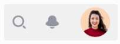

# Capítulo IV: Product Design
En este capítulo describimos las directrices de diseño y estilo para el producto, asegurando una experiencia visual coherente y atractiva para el usuario.

## 4.1. Style Guidelines.
En esta sección se describen las pautas generales de estilo que guían la apariencia visual del producto, incluyendo el uso de colores, tipografía y espaciado.

### 4.1.1. General Style Guidelines.
Las directrices generales aseguran una estética que refuerza la marca y proporciona claridad visual para los usuarios.

#### Historia de la marca
La marca busca transmitir modernidad y profesionalismo, reflejando estos valores en cada elemento visual del diseño.

#### Misión
Proporcionar a los usuarios una experiencia fluida y atractiva, con interfaces claras y consistentes.

#### Visión
Ser reconocidos como una marca que combina funcionalidad y estilo en el diseño de productos digitales.

#### Brand Name
El nombre de la marca es un elemento clave de nuestra identidad, representando los valores fundamentales de la empresa.

#### Colores
La paleta de colores está diseñada para proporcionar un equilibrio visual. Utilizamos una combinación de tonos brillantes y neutros para transmitir profesionalismo y modernidad.


#### Tipografía
Usamos la tipografía **Roboto** en diferentes pesos para establecer jerarquía visual y garantizar una legibilidad óptima. El color de la letra principal es `#404040`.


#### Espaciado
El espaciado entre elementos visuales asegura una estructura clara y organizada, ayudando a los usuarios a navegar por el contenido de forma fluida.

- **Tamaño de letra**: Las fuentes varían desde 12px hasta 98px según la jerarquía del texto.
- **Interlineado**: Mantenemos un interlineado proporcional para mejorar la legibilidad.

### 4.1.2. Web Style Guidelines.
Las pautas de estilo para la web están diseñadas para asegurar que el diseño sea funcional y atractivo tanto en dispositivos móviles como en pantallas grandes. Incluir consistencia en colores, tipografías y espaciado es clave para mantener la identidad visual en todas las plataformas.

## 4.2. Information Architecture.
En esta sección, se describe cómo se organizará el contenido en la plataforma **GoUni**, tanto en la web como en las aplicaciones móviles. Se busca que la estructura sea intuitiva para los estudiantes universitarios, permitiendo una navegación fluida y el acceso rápido a las principales funcionalidades de la plataforma.

<hr>

### 4.2.1. Organization System.
El Sistema de Organización de **GoUni** está diseñado para facilitar la interacción entre el usuario y la plataforma, asegurando que los estudiantes puedan encontrar y utilizar los servicios clave, como la búsqueda de viajes o la oferta de plazas en vehículos.

- **Jerarquía Visual**: La página principal destacará las acciones más importantes para el usuario, como “Buscar viaje” y “Publicar viaje”, con énfasis en botones de llamada a la acción que lleven a estas secciones.
- **Organización Secuencial**: Se aplicará a procesos clave como el registro de usuario, reserva de un viaje y configuración de perfil. Estos procesos se guiarán paso a paso, asegurando que los usuarios completen cada tarea sin problemas.
- **Organización Matricial**: Los filtros de búsqueda permitirán a los usuarios seleccionar viajes según el tipo de vehículo, horario y calificaciones del conductor, haciendo que sea más fácil encontrar un viaje que se ajuste a sus necesidades.
- **Esquemas de Categorización**: La categorización de la información podrá hacerse por orden alfabético (al buscar conductores por nombre), cronológico (al organizar las reservas según la fecha), o por audiencia (al segmentar entre conductores y pasajeros).

<br>

### 4.2.2. Labeling System.
En **GoUni**, las etiquetas se diseñarán para ser claras, directas y comprensibles para los estudiantes, priorizando una navegación simple y una experiencia de usuario intuitiva.

### Etiquetas:
- **Inicio**: Al hacer clic en el logo de GoUni, los usuarios serán redirigidos a la página principal.
- **Buscar Viaje**: Opción en el menú principal que permite a los estudiantes buscar viajes disponibles en su universidad.
- **Publicar Viaje**: Los usuarios con vehículo propio podrán acceder a esta opción para publicar su ruta y disponibilidad de asientos.
- **Reservas Actuales**: Sección donde los usuarios pueden ver y gestionar sus reservas actuales.
- **Perfil**: Permite a los usuarios gestionar sus datos personales, verificar su identidad y ver su historial de viajes.

Una vez que los usuarios se registren y accedan a su cuenta, aparecerán nuevas etiquetas como:
- **Mis Viajes**: Un lugar donde los usuarios pueden revisar sus reservas activas y pasadas.
- **Calificar Conductores**: Opción que aparece tras la finalización de un viaje, permitiendo dejar comentarios y puntuaciones.

<br>

### 4.2.3. SEO Tags and Meta Tags.
Los SEO Tags y Meta Tags son esenciales para mejorar la visibilidad de **GoUni** en los motores de búsqueda.

### Para la Landing Page:
```html
<meta charset="UTF-8">
<meta name="viewport" content="width=device-width, initial-scale=1.0">
<title>GoUni - Carpooling para Estudiantes Universitarios</title>
<meta name="description" content="GoUni es la plataforma de carpooling exclusiva para estudiantes universitarios, enfocada en la seguridad, sostenibilidad y economía colaborativa.">
<meta name="keywords" content="carpooling universitario, compartir autos estudiantes, movilidad sostenible, transporte colaborativo">
<meta name="author" content="GoUni Team">
```
### Para la Aplicación Web:
```html
<meta charset="UTF-8">
<meta name="viewport" content="width=device-width, initial-scale=1.0">
<title>GoUni - Comparte tu auto con otros estudiantes universitarios</title>
<meta name="description" content="Con GoUni, puedes compartir tu auto con otros estudiantes universitarios y reducir tus gastos de transporte mientras ayudas al medio ambiente.">
<meta name="keywords" content="carpooling estudiantes, compartir auto universidad, transporte sostenible, viaje colaborativo">
<meta name="author" content="GoUni Team">
```

<br>

### 4.2.4. Searching Systems.
El sistema de búsqueda en GoUni facilitará a los usuarios encontrar viajes disponibles de forma rápida y efectiva. La funcionalidad de búsqueda incluirá:

Búsqueda por Universidad: Los estudiantes podrán buscar viajes que conecten con su universidad específica.
Filtros de Búsqueda: Los usuarios podrán filtrar los resultados por tipo de vehículo, horario de salida, calificación del conductor y disponibilidad de plazas.
Organización de Resultados: Los resultados se podrán ordenar de manera alfabética, por hora de salida o por la proximidad del conductor al punto de recogida.



<br>

### 4.2.5. Navigation Systems.
El sistema de navegación de GoUni estará diseñado para que los usuarios puedan encontrar la información y realizar las acciones deseadas con el mínimo esfuerzo.

Navegación Principal: El menú superior incluirá accesos rápidos a las funciones clave: "Buscar Viaje", "Publicar Viaje", "Reservas Actuales" y "Perfil".
Navegación Móvil: En la versión móvil, el menú será desplegable para ahorrar espacio y mostrar solo las opciones más importantes de manera compacta. Los usuarios podrán regresar a la página de inicio pulsando el logo de GoUni.
Navegación Secundaria: En secciones como el perfil, habrá opciones adicionales para gestionar la cuenta, verificar la identidad o ajustar preferencias de notificaciones.


<br>

## 4.3. Landing Page UI Design.
<hr>
<td align="center">
En esta sección, presentamos el diseño de la interfaz de usuario
de la landing page para GoUni. El diseño se ha desarrollado teniendo
en cuenta la experiencia del usuario y la accesibilidad tanto en
versiones de escritorio como móviles. El objetivo principal es
proporcionar una navegación clara y atractiva. </td>

### 4.3.1. Landing Page Wireframe.
<td align="center">
A continuación, mostramos los wireframes de la landing page, 
los cuales representan la estructura básica y el layout sin 
elementos gráficos detallados. Estos sirven como una guía inicial
para el diseño visual, asegurando que todos los elementos
necesarios estén presentes y correctamente organizados.
</td>

Enlace a los wireframes de la Landing Page en Figma:

[Landing Page Wireframes Link](https://www.figma.com/design/wsF29U5csRMNSNzzX1BfIR/Landing-Page-Wireframe-GoUni?node-id=0-1&t=PrfjiFfYo27WAa3q-1)

#### Wireframe de la Landing Page en Figma:

#### Versión Desktop:

##### Wireframe de la página principal:

Wireframe de la sección Header:


Wireframe de la sección Hero:


Wireframe de la sección How It Works:


Wireframe de la sección Benefits of GoUni:


Wireframe de la sección Security:


Wireframe de la sección Plans:


Wireframe de la sección Our Apps and Portals:


Wireframe de la sección Contact Us:


Wireframe de la sección Footer:


##### Wireframe de la sección Sobre Nosotros:

Wireframe de la sección Header:


Wireframe de la sección Who We Are:


Wireframe de la sección Our Sponsor:


Wireframe de la sección whyGoUni?:


Wireframe de la sección Our Team:


Wireframe de la sección Footer:


##### Versión Mobile:

##### Wireframe de la página principal:

Wireframe de la sección Header:


Wireframe de la sección How It Works:


Wireframe de la sección Benefits of GoUni:


Wireframe de la sección Security:


Wireframe de la sección Plans:


Wireframe de la sección Our Apps and Portals:


Wireframe de la sección Contact Us:


Wireframe de la sección Footer:


##### Wireframe de la sección Sobre Nosotros:

Wireframe de la sección Header:


Wireframe de la sección Why GoUni?:


Wireframe de la sección Our Sponsors:


Wireframe de la sección Our Team:


Wireframe de la sección Footer:


### 4.3.2. Landing Page Mockup.
<td align="center">
Esta sección presenta los mockups de la landing page,
que ilustran el diseño final con detalles gráficos, tipografía,
y color. Los mockups son fundamentales para visualizar cómo se
verá la página final y para realizar ajustes antes del desarrollo.
</td>

Enlace a la mockup de la Landing Page en Figma:

#### Mockups de la Landing Page en Figma:

##### Versión Desktop:

#### Mockups de la página principal

Mockup de la sección Header:


Mockup de la sección Hero:


Mockup de la sección How It Works:


Mockup de la sección Benefits of GoUni:


Mockup de la sección Security:


Mockup de la sección Plans:


Mockup de la sección Our Apps and Portals:


Mockup de la sección Contact Us:


Mockup de la sección Footer:


#### Mockups de la sesion Sobre Nosotros:

Mockup de la sección Header:


Mockup de la sección Who We Are:


Mockup de la sección Why GoUni?:


Mockup de la sección Our Sponsors:


Mockup de la sección Our Team:


Mockup de la sección Footer:


##### Versión Mobile:

#### Mockups de la página principal

Mockup de la sección Header:


Mockup de la sección How It Works:


Mockup de la sección Benefits of GoUni:


Mockup de la sección Security:


Mockup de la sección Plans:


Mockup de la sección Our Apps and Portals:


Mockup de la sección Contact Us:


Mockup de la sección Footer:


##### Mockups de la sesion Sobre Nosotros:

Mockup de la sección Header:


Mockup de la sección Why GoUni?:


Mockup de la sección Our Sponsors:


Mockup de la sección Our Team:


Mockup de la sección Footer:


## 4.4. Web Applications UX/UI Design
.

### 4.4.1. Web Applications Wireframes
.

### 4.4.2. Web Applications Wireflow Diagrams

Enlace a traves de la herramienta LucidChart:

.

### 4.4.3. Web Applications Mock-ups
.

### Mock-ups versión Desktop:
#### Mock-ups de la página principal


Enlace a la mockup de la App Web en Figma:

### 4.4.4 Web Applications User Flow Diagrams.

Enlace de los User Flow Diagrams en LucidChart:


## 4.5. Web Applications Prototyping.
<hr>

### 4.6.3. Software Architecture Component Diagram.


## 4.7. Software Object-Oriented Design
### 4.7.1. Class Diagrams

### 4.7.2. Class Dictionary
<hr>
<br>

## 4.8. Database Design

### 4.8.1. Database Diagram

A continuación se detalla el modelo físico realizado para esta entrega, donde se consideró los requerimientos necesarios para el negocio.


